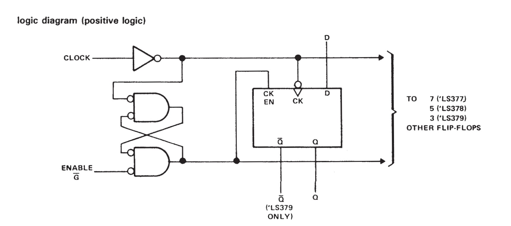

# JEFF 74x377 EXAMPLE

_8-bit register, clock enable.
Based on the 7400-series integrated circuits used in my
[programable-8-bit-microprocessor](https://github.com/JeffDeCola/my-verilog-examples/tree/master/systems/microprocessors/programable-8-bit-microprocessor)._

Table of Contents

* [SCHEMATIC](https://github.com/JeffDeCola/my-verilog-examples/tree/master/sequential-logic/registers/jeff-74x377#schematic)
* [TRUTH TABLE](https://github.com/JeffDeCola/my-verilog-examples/tree/master/sequential-logic/registers/jeff-74x377#truth-table)
* [VERILOG CODE](https://github.com/JeffDeCola/my-verilog-examples/tree/master/sequential-logic/registers/jeff-74x377#verilog-code)
* [RUN (SIMULATE)](https://github.com/JeffDeCola/my-verilog-examples/tree/master/sequential-logic/registers/jeff-74x377#run-simulate)
* [CHECK WAVEFORM](https://github.com/JeffDeCola/my-verilog-examples/tree/master/sequential-logic/registers/jeff-74x377#check-waveform)
* [TESTED IN HARDWARE - BURNED TO A FPGA](https://github.com/JeffDeCola/my-verilog-examples/tree/master/sequential-logic/registers/jeff-74x377#tested-in-hardware---burned-to-a-fpga)

Documentation and Reference

* I'm using my
  [d-flip-flop](https://github.com/JeffDeCola/my-verilog-examples/tree/master/basic-code/sequential-logic/d-flip-flop)

## OVERVIEW

_I used
[iverilog](https://github.com/JeffDeCola/my-cheat-sheets/tree/master/hardware/tools/simulation/iverilog-cheat-sheet)
to simulate and
[GTKWave](https://github.com/JeffDeCola/my-cheat-sheets/tree/master/hardware/tools/simulation/gtkwave-cheat-sheet)
to view the waveform. I also used
[Xilinx Vivado](https://github.com/JeffDeCola/my-cheat-sheets/tree/master/hardware/tools/synthesis/xilinx-vivado-cheat-sheet)
to synthesize and program this example on a
[Digilent ARTY-S7](https://github.com/JeffDeCola/my-cheat-sheets/tree/master/hardware/development/fpga-development-boards/digilent-arty-s7-cheat-sheet)
FPGA development board._

## SCHEMATIC

I designed this register form the 1976 Texas Instruments spec sheet.
I kind of wish it had it clear but this is ok.



## TRUTH TABLE

| clk     | en_bar | d     | q      |
|:-------:|:------:|:-----:|:------:|
| x       |  1     |  X    | q      |
| tick    |  0     |  1    | 1      |
| tick    |  0     |  0    | 0      |
| 0       |  X     |  X    | q      |

## VERILOG CODE

The
[and_gates.v](https://github.com/JeffDeCola/my-verilog-examples/blob/master/basic-code/combinational-logic/and_gates/and_gates.v)
uses behavioral modeling.

## RUN (SIMULATE)

I created,

* [and_gates_tb.v](https://github.com/JeffDeCola/my-verilog-examples/blob/master/basic-code/combinational-logic/and_gates/and_gates_tb.v)
the testbench
* [and_gates.vh](https://github.com/JeffDeCola/my-verilog-examples/blob/master/basic-code/combinational-logic/and_gates/and_gates.vh)
the header file listing the verilog code
* [run-simulation.sh](https://github.com/JeffDeCola/my-verilog-examples/blob/master/basic-code/combinational-logic/and_gates/run-simulation.sh)
a script containing the commands below

Use **iverilog** to compile the verilog to a vvp format
which is used by the vvp runtime simulation engine,

```bash
iverilog -o and_gates_tb.vvp and_gates_tb.v and_gates.vh
```

Use **vvp** to run the simulation, which creates a waveform dump file *.vcd.

```bash
vvp and_gates_tb.vvp
```

## CHECK WAVEFORM

Open the waveform file and_gates_tb.vcd file with GTKWave,

```bash
gtkwave -f and_gates_tb.vcd &
```

Save your waveform to a .gtkw file.

Now you can
[launch-gtkwave.sh](https://github.com/JeffDeCola/my-verilog-examples/blob/master/launch-GTKWave-script/launch-gtkwave.sh)
anytime you want,

```bash
gtkwave -f and_gates_tb.gtkw &
```


## TESTED IN HARDWARE - BURNED TO A FPGA

The above code was synthesized using the
[Xilinx Vivado](https://github.com/JeffDeCola/my-cheat-sheets/tree/master/hardware/tools/synthesis/xilinx-vivado-cheat-sheet)
IDE software suite and burned to a FPGA development board.
