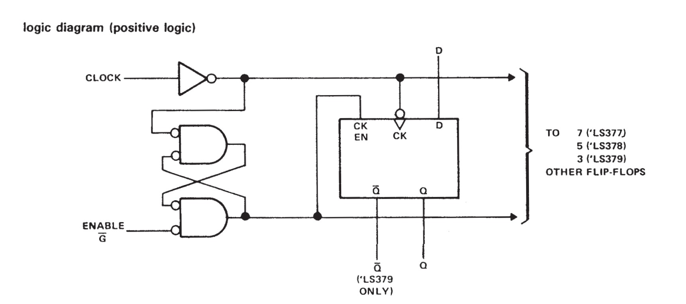
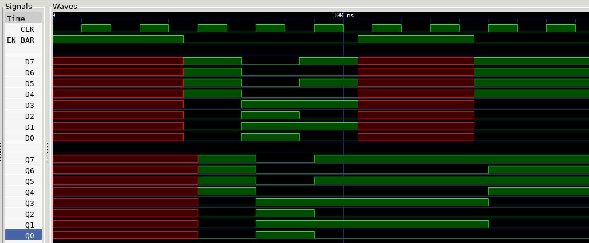

# JEFF 74x377 EXAMPLE

_8-bit register, clock enable.
Based on the 7400-series integrated circuits used in my
[programable_8_bit_microprocessor](https://github.com/JeffDeCola/my-verilog-examples/tree/master/systems/microprocessors/programable_8_bit_microprocessor)._

Table of Contents

* [OVERVIEW](https://github.com/JeffDeCola/my-verilog-examples/tree/master/sequential-logic/registers/jeff_74x377#overview)
* [SCHEMATIC](https://github.com/JeffDeCola/my-verilog-examples/tree/master/sequential-logic/registers/jeff_74x377#schematic)
* [TRUTH TABLE](https://github.com/JeffDeCola/my-verilog-examples/tree/master/sequential-logic/registers/jeff_74x377#truth-table)
* [VERILOG CODE](https://github.com/JeffDeCola/my-verilog-examples/tree/master/sequential-logic/registers/jeff_74x377#verilog-code)
* [RUN (SIMULATE)](https://github.com/JeffDeCola/my-verilog-examples/tree/master/sequential-logic/registers/jeff_74x377#run-simulate)
* [VIEW WAVEFORM](https://github.com/JeffDeCola/my-verilog-examples/tree/master/sequential-logic/registers/jeff_74x377#view-waveform)
* [TESTED IN HARDWARE - BURNED TO A FPGA](https://github.com/JeffDeCola/my-verilog-examples/tree/master/sequential-logic/registers/jeff_74x377#tested-in-hardware---burned-to-a-fpga)

Documentation and Reference

* I'm using my
  [d_flip_flop_pos_edge_sync_en](https://github.com/JeffDeCola/my-verilog-examples/tree/master/basic-code/sequential-logic/d_flip_flop_pos_edge_sync_en)
  in this model

## OVERVIEW

_I used
[iverilog](https://github.com/JeffDeCola/my-cheat-sheets/tree/master/hardware/tools/simulation/iverilog-cheat-sheet)
to simulate and
[GTKWave](https://github.com/JeffDeCola/my-cheat-sheets/tree/master/hardware/tools/simulation/gtkwave-cheat-sheet)
to view the waveform. I also used
[Xilinx Vivado](https://github.com/JeffDeCola/my-cheat-sheets/tree/master/hardware/tools/synthesis/xilinx-vivado-cheat-sheet)
to synthesize and program this example on a
[Digilent ARTY-S7](https://github.com/JeffDeCola/my-cheat-sheets/tree/master/hardware/development/fpga-development-boards/digilent-arty-s7-cheat-sheet)
FPGA development board._

## SCHEMATIC

I designed this register form the 1976 Texas Instruments spec sheet.



## TRUTH TABLE

| en_bar | clk     | d  | q |
|:------:|:-------:|:--:|:-:|
|  1     | x       | x  | q |
|  0     | posedge | 1  | 1 |
|  0     | posedge | 0  | 0 |
|  x     |  0      | x  | q |

## VERILOG CODE

The
[jeff_74x377.v](https://github.com/JeffDeCola/my-verilog-examples/blob/master/sequential-logic/registers/jeff_74x377/jeff_74x377.v)
behavioral model,

```verilog
    wire  NOTHING;

    // EN AND FEEDBACK
    assign clk_feedback = (clk & ~en_feedback);
    assign en_feedback = (~en_bar & ~clk_feedback);

    d_flip_flop_pos_edge_sync_en_behavioral DFF7
        (.clk(clk), .en(en_feedback), .d(d7), .q(q7), .qbar(NOTHING));
    d_flip_flop_pos_edge_sync_en_behavioral DFF6
        (.clk(clk), .en(en_feedback), .d(d6), .q(q6), .qbar(NOTHING));
    d_flip_flop_pos_edge_sync_en_behavioral DFF5
        (.clk(clk), .en(en_feedback), .d(d5), .q(q5), .qbar(NOTHING));
    d_flip_flop_pos_edge_sync_en_behavioral DFF4
        (.clk(clk), .en(en_feedback), .d(d4), .q(q4), .qbar(NOTHING));
    d_flip_flop_pos_edge_sync_en_behavioral DFF3
        (.clk(clk), .en(en_feedback), .d(d3), .q(q3), .qbar(NOTHING));
    d_flip_flop_pos_edge_sync_en_behavioral DFF2
        (.clk(clk), .en(en_feedback), .d(d2), .q(q2), .qbar(NOTHING));
    d_flip_flop_pos_edge_sync_en_behavioral DFF1
        (.clk(clk), .en(en_feedback), .d(d1), .q(q1), .qbar(NOTHING));
    d_flip_flop_pos_edge_sync_en_behavioral DFF0
        (.clk(clk), .en(en_feedback), .d(d0), .q(q0), .qbar(NOTHING));
```

## RUN (SIMULATE)

The testbench uses two files,

* [jeff_74x377_tb.v](https://github.com/JeffDeCola/my-verilog-examples/blob/master/sequential-logic/registers/jeff_74x377/jeff_74x377_tb.v)
  the testbench
* [jeff_74x377_tb.tv](https://github.com/JeffDeCola/my-verilog-examples/blob/master/sequential-logic/registers/jeff_74x377/jeff_74x377_tb.tv)
  the test vectors and expected results

with,

* [jeff_74x377.vh](https://github.com/JeffDeCola/my-verilog-examples/blob/master/sequential-logic/registers/jeff_74x377/jeff_74x377.vh)
  is the header file listing the verilog models
* [run-simulation.sh](https://github.com/JeffDeCola/my-verilog-examples/blob/master/sequential-logic/registers/jeff_74x377/run-simulation.sh)
  is a script containing the commands below

Use **iverilog** to compile the verilog to a vvp format
which is used by the vvp runtime simulation engine,

```bash
iverilog -o jeff_74x377_tb.vvp jeff_74x377_tb.v jeff_74x377.vh
```

Use **vvp** to run the simulation, which checks the UUT
and creates a waveform dump file *.vcd.

```bash
vvp jeff_74x377_tb.vvp
```

The output of the test,

```text
TEST START --------------------------------

                 | TIME(ns) | EN_BAR | D7 D6 D5 D4 D3 D2 D1 D0 | Q7 Q6 Q5 Q4 Q3 Q2 Q1 Q0 |
                 -------------------------------------------------------------------------
   0        INIT |        0 |   1    | x  x  x  x  x  x  x  x  | x  x  x  x  x  x  x  x  |
   1           - |       25 |   1    | x  x  x  x  x  x  x  x  | x  x  x  x  x  x  x  x  |
   2      ENABLE |       45 |   0    | 1  1  1  1  0  0  0  0  | x  x  x  x  x  x  x  x  |
   2      ENABLE |       50 |   0    | 1  1  1  1  0  0  0  0  | 1  1  1  1  0  0  0  0  |
   3      ENABLE |       65 |   0    | 0  0  0  0  1  1  1  1  | 1  1  1  1  0  0  0  0  |
   3      ENABLE |       70 |   0    | 0  0  0  0  1  1  1  1  | 0  0  0  0  1  1  1  1  |
   4      ENABLE |       85 |   0    | 1  0  1  0  1  0  1  0  | 0  0  0  0  1  1  1  1  |
   4      ENABLE |       90 |   0    | 1  0  1  0  1  0  1  0  | 1  0  1  0  1  0  1  0  |
   5           - |      105 |   1    | x  x  x  x  x  x  x  x  | 1  0  1  0  1  0  1  0  |
   6           - |      125 |   1    | x  x  x  x  x  x  x  x  | 1  0  1  0  1  0  1  0  |
   7      ENABLE |      145 |   0    | 1  1  1  1  0  0  0  0  | 1  0  1  0  1  0  1  0  |
   7      ENABLE |      150 |   0    | 1  1  1  1  0  0  0  0  | 1  1  1  1  0  0  0  0  |
   8      ENABLE |      165 |   0    | 1  1  1  1  0  0  0  0  | 1  1  1  1  0  0  0  0  |

 VECTORS:    8
  ERRORS:    0

TEST END ----------------------------------
```

## VIEW WAVEFORM

Open the waveform file jeff_74x377_tb.vcd file with GTKWave,

```bash
gtkwave -f jeff_74x377_tb.vcd &
```

Save your waveform to a .gtkw file.

Now you can use the script
[launch-gtkwave.sh](https://github.com/JeffDeCola/my-verilog-examples/blob/master/launch-GTKWave-script/launch-gtkwave.sh)
anytime you want,

```bash
gtkwave -f jeff_74x377_tb.gtkw &
```



## TESTED IN HARDWARE - BURNED TO A FPGA

The above code was synthesized using the
[Xilinx Vivado](https://github.com/JeffDeCola/my-cheat-sheets/tree/master/hardware/tools/synthesis/xilinx-vivado-cheat-sheet)
IDE software suite and burned to a FPGA development board.
