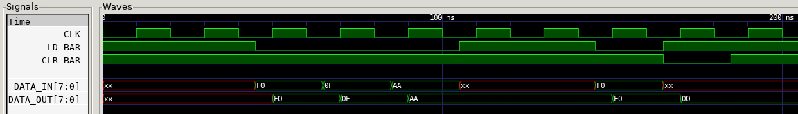

# SIMPLE 8-BIT REGISTER EXAMPLE

_A simple 8-bit register with synchronous load and clear._

Table of Contents

* [OVERVIEW](https://github.com/JeffDeCola/my-verilog-examples/tree/master/sequential-logic/registers/simple_8_bit_register#overview)
* [SCHEMATIC](https://github.com/JeffDeCola/my-verilog-examples/tree/master/sequential-logic/registers/simple_8_bit_register#schematic)
* [TRUTH TABLE](https://github.com/JeffDeCola/my-verilog-examples/tree/master/sequential-logic/registers/simple_8_bit_register#truth-table)
* [VERILOG CODE](https://github.com/JeffDeCola/my-verilog-examples/tree/master/sequential-logic/registers/simple_8_bit_register#verilog-code)
* [RUN (SIMULATE)](https://github.com/JeffDeCola/my-verilog-examples/tree/master/sequential-logic/registers/simple_8_bit_register#run-simulate)
* [VIEW WAVEFORM](https://github.com/JeffDeCola/my-verilog-examples/tree/master/sequential-logic/registers/simple_8_bit_register#view-waveform)
* [TESTED IN HARDWARE - BURNED TO A FPGA](https://github.com/JeffDeCola/my-verilog-examples/tree/master/sequential-logic/registers/simple_8_bit_register#tested-in-hardware---burned-to-a-fpga)

## OVERVIEW

_I used
[iverilog](https://github.com/JeffDeCola/my-cheat-sheets/tree/master/hardware/tools/simulation/iverilog-cheat-sheet)
to simulate and
[GTKWave](https://github.com/JeffDeCola/my-cheat-sheets/tree/master/hardware/tools/simulation/gtkwave-cheat-sheet)
to view the waveform. I also used
[Xilinx Vivado](https://github.com/JeffDeCola/my-cheat-sheets/tree/master/hardware/tools/synthesis/xilinx-vivado-cheat-sheet)
to synthesize and program this example on a
[Digilent ARTY-S7](https://github.com/JeffDeCola/my-cheat-sheets/tree/master/hardware/development/fpga-development-boards/digilent-arty-s7-cheat-sheet)
FPGA development board._

## SCHEMATIC

This may help,


## TRUTH TABLE

| clk       | clr_bar | ld_bar | IN    | OUT    |
|:---------:|:-------:|:------:|:-----:|:-------|
| posedge   | 0       | x      | x     | 0      |
| posedge   | 1       | 0      | 0     | 0      |
| posedge   | 1       | 0      | 1     | 1      |
| posedge   | 1       | 1      | x     | OUT    |

## VERILOG CODE

The
[simple_8_bit_register.v](https://github.com/JeffDeCola/my-verilog-examples/blob/master/sequential-logic/registers/simple_8_bit_register/simple_8_bit_register.v)
behavioral model,

```verilog
    // 8-BIT REGISTER
    // ALWAYS BLOCK with NON-BLOCKING PROCEDURAL ASSIGNMENT STATEMENT
    always @ (posedge clk) begin
        if (~clr_bar) begin
            data_out <= 0;
        end else if (~ld_bar) begin
            data_out <= data_in;
        end
    end
```

## RUN (SIMULATE)

The testbench uses two files,

* [simple_8_bit_register_tb.v](https://github.com/JeffDeCola/my-verilog-examples/blob/master/sequential-logic/registers/simple_8_bit_register/simple_8_bit_register_tb.v)
  the testbench
* [simple_8_bit_register_tb.tv](https://github.com/JeffDeCola/my-verilog-examples/blob/master/sequential-logic/registers/simple_8_bit_register/simple_8_bit_register_tb.tv)
  the test vectors and expected results

with,

* [simple_8_bit_register.vh](https://github.com/JeffDeCola/my-verilog-examples/blob/master/sequential-logic/registers/simple_8_bit_register/simple_8_bit_register.vh)
  is the header file listing the verilog models
* [run-simulation.sh](https://github.com/JeffDeCola/my-verilog-examples/blob/master/sequential-logic/registers/simple_8_bit_register/run-simulation.sh)
  is a script containing the commands below

Use **iverilog** to compile the verilog to a vvp format
which is used by the vvp runtime simulation engine,

```bash
iverilog -o simple_8_bit_register_tb.vvp simple_8_bit_register_tb.v simple_8_bit_register.vh
```

Use **vvp** to run the simulation, which checks the UUT
and creates a waveform dump file *.vcd.

```bash
vvp simple_8_bit_register_tb.vvp
```

The output of the test,

```text
TEST START --------------------------------

                 | TIME(ns) | LD_BAR | CLR_BAR | DATA_IN  | DATA_OUT |
                 -----------------------------------------------------
   1        INIT |       15 |   1    |    1    | xxxxxxxx | xxxxxxxx |
   2           - |       35 |   1    |    1    | xxxxxxxx | xxxxxxxx |
   3      ENABLE |       55 |   0    |    1    | 11110000 | 11110000 |
   4      ENABLE |       75 |   0    |    1    | 00001111 | 00001111 |
   5      ENABLE |       95 |   0    |    1    | 10101010 | 10101010 |
   6           - |      115 |   1    |    1    | xxxxxxxx | 10101010 |
   7           - |      135 |   1    |    1    | xxxxxxxx | 10101010 |
   8      ENABLE |      155 |   0    |    1    | 11110000 | 11110000 |
   9       CLEAR |      175 |   1    |    0    | xxxxxxxx | 00000000 |
  10           - |      195 |   1    |    1    | xxxxxxxx | 00000000 |

 VECTORS:   10
  ERRORS:    0

TEST END ----------------------------------
```

## VIEW WAVEFORM

Open the waveform file simple_8_bit_register_tb.vcd file with GTKWave,

```bash
gtkwave -f simple_8_bit_register_tb.vcd &
```

Save your waveform to a .gtkw file.

Now you can use the script
[launch-gtkwave.sh](https://github.com/JeffDeCola/my-verilog-examples/blob/master/launch-GTKWave-script/launch-gtkwave.sh)
anytime you want,

```bash
gtkwave -f simple_8_bit_register_tb.gtkw &
```



## TESTED IN HARDWARE - BURNED TO A FPGA

The above code was synthesized using the
[Xilinx Vivado](https://github.com/JeffDeCola/my-cheat-sheets/tree/master/hardware/tools/synthesis/xilinx-vivado-cheat-sheet)
IDE software suite and burned to a FPGA development board.
