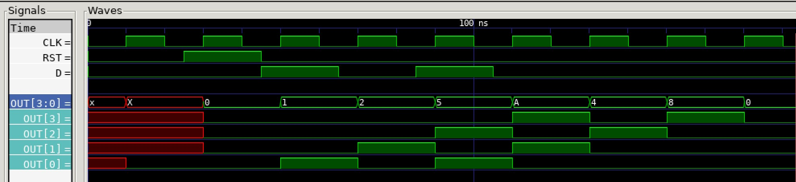

# LEFT SHIFT REGISTER EXAMPLE

_A 4-bit left shift register._

Table of Contents

* [OVERVIEW](https://github.com/JeffDeCola/my-verilog-examples/tree/master/sequential-logic/shifters/left_shift_register#overview)
* [TRUTH TABLE](https://github.com/JeffDeCola/my-verilog-examples/tree/master/sequential-logic/shifters/left_shift_register#truth-table)
* [VERILOG CODE](https://github.com/JeffDeCola/my-verilog-examples/tree/master/sequential-logic/shifters/left_shift_register#verilog-code)
* [RUN (SIMULATE)](https://github.com/JeffDeCola/my-verilog-examples/tree/master/sequential-logic/shifters/left_shift_register#run-simulate)
* [VIEW WAVEFORM](https://github.com/JeffDeCola/my-verilog-examples/tree/master/sequential-logic/shifters/left_shift_register#view-waveform)
* [TESTED IN HARDWARE - BURNED TO A FPGA](https://github.com/JeffDeCola/my-verilog-examples/tree/master/sequential-logic/shifters/left_shift_register#tested-in-hardware---burned-to-a-fpga)

## OVERVIEW

_I used
[iverilog](https://github.com/JeffDeCola/my-cheat-sheets/tree/master/hardware/tools/simulation/iverilog-cheat-sheet)
to simulate and
[GTKWave](https://github.com/JeffDeCola/my-cheat-sheets/tree/master/hardware/tools/simulation/gtkwave-cheat-sheet)
to view the waveform. I also used
[Xilinx Vivado](https://github.com/JeffDeCola/my-cheat-sheets/tree/master/hardware/tools/synthesis/xilinx-vivado-cheat-sheet)
to synthesize and program this example on a
[Digilent ARTY-S7](https://github.com/JeffDeCola/my-cheat-sheets/tree/master/hardware/development/fpga-development-boards/digilent-arty-s7-cheat-sheet)
FPGA development board._

## TRUTH TABLE

| rst | d | out     |
|:---:|:-:|:-------:|
|  1  | 0 | 0000    |
|  0  | 0 | {out,0} |
|  0  | 1 | {out,1} |

## VERILOG CODE

The
[left_shift_register.v](https://github.com/JeffDeCola/my-verilog-examples/blob/master/sequential-logic/shifters/left_shift_register/left_shift_register.v)
behavioral model,

```verilog
    // LEFT SHIFT REGISTER
    // ALWAYS BLOCK with NON-BLOCKING PROCEDURAL ASSIGNMENT STATEMENT
    always @ (posedge clk) begin
        if (rst) begin
            out <= 4'b0000;
        end else begin
            out <= {out[2:0], d};
        end
    end
```

## RUN (SIMULATE)

The testbench uses two files,

* [left_shift_register_tb.v](https://github.com/JeffDeCola/my-verilog-examples/blob/master/sequential-logic/shifters/left_shift_register/left_shift_register_tb.v)
  the testbench
* [left_shift_register_tb.tv](https://github.com/JeffDeCola/my-verilog-examples/blob/master/sequential-logic/shifters/left_shift_register/left_shift_register_tb.tv)
  the test vectors and expected results

with,

* [left_shift_register.vh](https://github.com/JeffDeCola/my-verilog-examples/blob/master/sequential-logic/shifters/left_shift_register/left_shift_register.vh)
  is the header file listing the verilog models
* [run-simulation.sh](https://github.com/JeffDeCola/my-verilog-examples/blob/master/sequential-logic/shifters/left_shift_register/run-simulation.sh)
  is a script containing the commands below

Use **iverilog** to compile the verilog to a vvp format
which is used by the vvp runtime simulation engine,

```bash
iverilog -o left_shift_register_tb.vvp left_shift_register_tb.v left_shift_register.vh
```

Use **vvp** to run the simulation, which checks the UUT
and creates a waveform dump file *.vcd.

```bash
vvp left_shift_register_tb.vvp
```

The output of the test,

```text
TEST START --------------------------------

                 | TIME(ns) | RST | D | OUT  |
                 -----------------------------
   1        INIT |       15 | 0   | 0 | xxx0 |
   2       RESET |       35 | 1   | 0 | 0000 |
   3        DATA |       55 | 0   | 1 | 0001 |
   4       SHIFT |       75 | 0   | 0 | 0010 |
   5        DATA |       95 | 0   | 1 | 0101 |
   6       SHIFT |      115 | 0   | 0 | 1010 |
   7       SHIFT |      135 | 0   | 0 | 0100 |
   8       SHIFT |      155 | 0   | 0 | 1000 |
   9       SHIFT |      175 | 0   | 0 | 0000 |

 VECTORS:    9
  ERRORS:    0

TEST END ----------------------------------
```

## VIEW WAVEFORM

Open the waveform file left_shift_register_tb.vcd file with GTKWave,

```bash
gtkwave -f left_shift_register_tb.vcd &
```

Save your waveform to a .gtkw file.

Now you can use the script
[launch-gtkwave.sh](https://github.com/JeffDeCola/my-verilog-examples/blob/master/launch-GTKWave-script/launch-gtkwave.sh)
anytime you want,

```bash
gtkwave -f left_shift_register_tb.gtkw &
```



## TESTED IN HARDWARE - BURNED TO A FPGA

The above code was synthesized using the
[Xilinx Vivado](https://github.com/JeffDeCola/my-cheat-sheets/tree/master/hardware/tools/synthesis/xilinx-vivado-cheat-sheet)
IDE software suite and burned to a FPGA development board.
