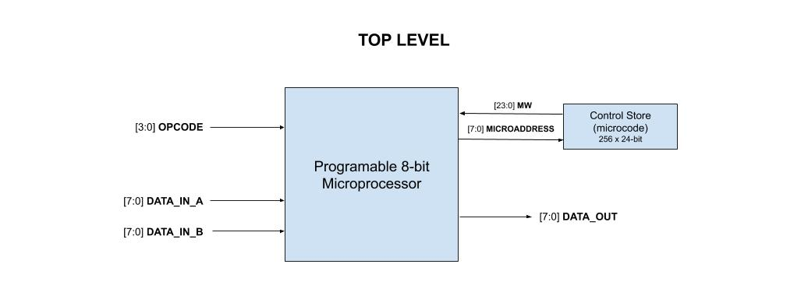
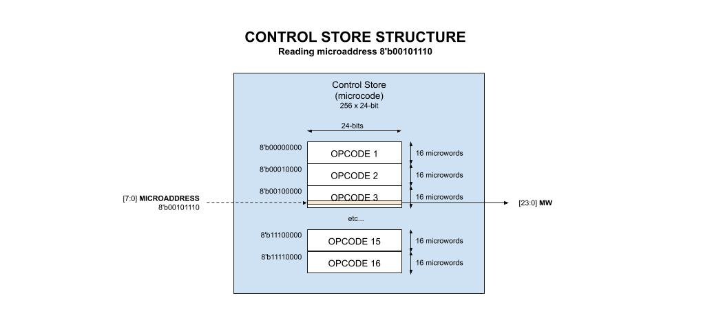

# programable-8-bit-microprocessor example

_A programable 8-bit microprocessor I designed in VHDL for my
[Master's Thesis](https://github.com/JeffDeCola/my-masters-thesis).
I translated it from VHDL to verilog._

Table of Contents,

* [STATS](https://github.com/JeffDeCola/my-systemverilog-examples/tree/master/systems/microprocessors/programable-8-bit-microprocessor#stats)
* [TOP LEVEL (HOW IT WORKS)](https://github.com/JeffDeCola/my-systemverilog-examples/tree/master/systems/microprocessors/programable-8-bit-microprocessor#top-level-how-it-works)
  * [THE CONTROL AND PROCESSOR SECTION](https://github.com/JeffDeCola/my-systemverilog-examples/tree/master/systems/microprocessors/programable-8-bit-microprocessor#the-control-and-processor-section)
* [OPCODE (THE USER INSTRUCTION)](https://github.com/JeffDeCola/my-systemverilog-examples/tree/master/systems/microprocessors/programable-8-bit-microprocessor#opcode-the-user-instruction)
* [MICROCODE (THE INTERNAL INSTRUCTIONS)](https://github.com/JeffDeCola/my-systemverilog-examples/tree/master/systems/microprocessors/programable-8-bit-microprocessor#microcode-the-internal-instructions)
  * [ADD](https://github.com/JeffDeCola/my-systemverilog-examples/tree/master/systems/microprocessors/programable-8-bit-microprocessor#add)
  * [SUBTRACT](https://github.com/JeffDeCola/my-systemverilog-examples/tree/master/systems/microprocessors/programable-8-bit-microprocessor#subtract)
* [MORE DETAIL (UNDER THE HOOD)](https://github.com/JeffDeCola/my-systemverilog-examples/tree/master/systems/microprocessors/programable-8-bit-microprocessor#more-detail-under-the-hood)
  * [CONTROL SECTION](https://github.com/JeffDeCola/my-systemverilog-examples/tree/master/systems/microprocessors/programable-8-bit-microprocessor#control-section)
  * [PROCESSOR SECTION](https://github.com/JeffDeCola/my-systemverilog-examples/tree/master/systems/microprocessors/programable-8-bit-microprocessor#processor-section)
* [RUN (SIMULATE)](https://github.com/JeffDeCola/my-systemverilog-examples/tree/master/systems/microprocessors/programable-8-bit-microprocessor#run-simulate)
* [CHECK WAVEFORM](https://github.com/JeffDeCola/my-systemverilog-examples/tree/master/systems/microprocessors/programable-8-bit-microprocessor#check-waveform)

Logic used,

* [and2](https://github.com/JeffDeCola/my-systemverilog-examples/tree/master/basic-code/combinational-logic/and2)
  2-input AND gate
* [nand4](https://github.com/JeffDeCola/my-systemverilog-examples/tree/master/basic-code/combinational-logic/nand4)
  4-input NAND gate
* [nor2](https://github.com/JeffDeCola/my-systemverilog-examples/tree/master/basic-code/combinational-logic/nor2)
  2-input OR gate
* [not1](https://github.com/JeffDeCola/my-systemverilog-examples/tree/master/basic-code/combinational-logic/not1)
  NOT gate
* [or2](https://github.com/JeffDeCola/my-systemverilog-examples/tree/master/basic-code/combinational-logic/or2)
  2-input OR gate
* [xor2](https://github.com/JeffDeCola/my-systemverilog-examples/tree/master/basic-code/combinational-logic/xor2)
  2-input XOR gate
* [jk-flip-flop](https://github.com/JeffDeCola/my-systemverilog-examples/tree/master/basic-code/sequential-logic/jk-flip-flop)
  A jk flip-flop with asynchronous clear (Used in jeff-74x161)
* [jeff-74x181](https://github.com/JeffDeCola/my-systemverilog-examples/tree/master/combinational-logic/alus/jeff-74x181)
  4-bit alu (arithmetic logic unit) and function generator
* [jeff-74x151](https://github.com/JeffDeCola/my-systemverilog-examples/tree/master/combinational-logic/multiplexers-and-demultiplexers/jeff-74x151)
  8-line to 1-line data selector/multiplexer
* [jeff-74x157](https://github.com/JeffDeCola/my-systemverilog-examples/tree/master/combinational-logic/multiplexers-and-demultiplexers/jeff-74x157)
  Quad 2-line to 1-line data selector/multiplexer, non-inverting outputs
* [jeff-74x161](https://github.com/JeffDeCola/my-systemverilog-examples/tree/master/sequential-logic/counters/jeff-74x161)
  Synchronous presettable 4-bit binary counter, asynchronous clear
* [jeff-74x377](https://github.com/JeffDeCola/my-systemverilog-examples/tree/master/sequential-logic/registers/jeff-74x377)
  8-bit register, clock enable

[GitHub Webpage](https://jeffdecola.github.io/my-systemverilog-examples/)

## STATS

* Build around the
  [74x161](https://github.com/JeffDeCola/my-systemverilog-examples/tree/master/combinational-logic/alus/jeff-74x181)
  ALU
  * 16 binary arithmetic operations
  * 16 logic operations
  * 4-bit words
* 8-bit data processing
* Up to 16 Opcodes
  * Programable via microcode
* Microcode
  * 256 x 24-bit microcode storage
  * 24-bit microword
* Pin count
  * 56 pins if using hardcoded internal microcode
    * 24 Input pins
    * 8 Output pins
  * 64 if using external microcode
    * 48 Input pins
    * 16 Output pins
* Synthesizable verilog code

## TOP LEVEL (HOW IT WORKS)

Based on an instruction (opcode) this processor takes in data,
processes that data via the alu and spits out the result. That's about it.

This may help,



MAIN INPUTS,

* [3:0] **OPCODE** _The instruction like ADD and SUBTRACT_
* [7:0] **DATA_IN_A**
* [7:0] **DATA_IN_B**

OUTPUT,

* [7:0] **DATA_OUT**

OTHER INPUTS,

* **SYSTEM_CLK**  _Clock_
* **GO_BAR** _Kicks it off_
* **JAM** _tbd_
* **RESET** _tbd_

### THE CONTROL AND PROCESSOR SECTION

This design is broken into two main sections,

* **TOP**
  ([programable-8-bit-microprocessor.v](https://github.com/JeffDeCola/my-systemverilog-examples/blob/master/systems/microprocessors/programable-8-bit-microprocessor/programable-8-bit-microprocessor.v))
  * **CONTROL_SECTION**
    ([control.v](https://github.com/JeffDeCola/my-systemverilog-examples/blob/master/systems/microprocessors/programable-8-bit-microprocessor/control/control.v))
    * The brains. Handles the opcode, microcode and control the process section
  * **PROCESSOR_SECTION**
    ([processor.v](https://github.com/JeffDeCola/my-systemverilog-examples/blob/master/systems/microprocessors/programable-8-bit-microprocessor/processor/processor.v))
    * Crunches the data controlled by the control section

A little more top level detail from my
[Master's Thesis](https://github.com/JeffDeCola/my-masters-thesis),


## OPCODE (THE USER INSTRUCTION)

The `opcode` (Operation Code) is the instruction giving to my processor to tell
it what to do. In this design there can be up to 16 opcodes, two of which
I have programed (in microcode - next section),

* [3:0] **OPCODE**
  * 4'h0:
    _TBD_
  * 4'h1:
    [ADD](https://github.com/JeffDeCola/my-systemverilog-examples/tree/master/systems/microprocessors/programable-8-bit-microprocessor#add)
  * 4'h2:
    [SUBTRACT](https://github.com/JeffDeCola/my-systemverilog-examples/tree/master/systems/microprocessors/programable-8-bit-microprocessor#subtract)
  * etc...
  * 4'hF:
    _TBD_

## MICROCODE (THE INTERNAL INSTRUCTIONS)

The `microcode`are the internal instructions the processor uses
to accomplish the users opcode instruction.

The control section gets the microword **[23:0]MW** using the
**[7:0]MICROADDRESS**. Hence there can be up to 256 x 24-bit microwords.

Each opcode accesses a section of this memory.  Hence, there are 16
sections equally divided.

This may help,



The 24-bit microword (MW) fields are as follows,

* [23:0] **MW**
  * [3:0] **MICRO_AD_LOW**
  * [7:4] **MICRO_AD_HIGH**
  * [8] **COUNT**
  * [12:9] **BOP**
  * [23:13] CONTROL_BITS
    * [13] **A_SOURCE**
    * [14] **B_SOURCE**
    * [19:15] **ALU_FUNC**
    * [20] **CIN**
    * [23:21] **ALU_DEST**

The first 13 bits are used in the control sections and the top 13 bits
**CONTROL_BITS** are used in the process section.

The microcode is located in
[control-store.v](https://github.com/JeffDeCola/my-systemverilog-examples/blob/master/systems/microprocessors/programable-8-bit-microprocessor/control-store/control-store.v).

### ADD

To accomplish an **ADD** opcode instruction, the microcode is,

| # | ALU_DEST | CIN | ALU_FUNC | B_SOURCE | A_SOURCE |  BOP | COUNT | MICRO_AD_HIGH | MICRO_AD_LOW |
|--:|:--------:|:---:|:--------:|:--------:|:--------:|:----:|:-----:|:-------------:|:------------:|
| 1 |    000   |  0  |   00000  |     0    |     0    | 0000 |   0   |      0000     |     0000     |
| 2 |    000   |  1  |   00000  |     0    |     1    | 0000 |   0   |      0000     |     0000     |
| 3 |    000   |  0  |   00000  |     1    |     0    | 0000 |   0   |      0000     |     0000     |
| 4 |    000   |  1  |   00000  |     0    |     1    | 0000 |   0   |      0000     |     0000     |

### SUBTRACT

To accomplish an **SUBTRACT** opcode instruction, the microcode is,

| # | ALU_DEST | CIN | ALU_FUNC | B_SOURCE | A_SOURCE |  BOP | COUNT | MICRO_AD_HIGH | MICRO_AD_LOW |
|--:|:--------:|:---:|:--------:|:--------:|:--------:|:----:|:-----:|:-------------:|:------------:|
| 1 |    000   |  0  |   00000  |     0    |     0    | 0000 |   0   |      0000     |     0000     |
| 2 |    000   |  1  |   00000  |     0    |     1    | 0000 |   0   |      0000     |     0000     |
| 3 |    000   |  0  |   00000  |     1    |     0    | 0000 |   0   |      0000     |     0000     |
| 4 |    000   |  1  |   00000  |     0    |     1    | 0000 |   0   |      0000     |     0000     |

## MORE DETAIL (UNDER THE HOOD)

Here is a little more detail about the control and processor section.

### CONTROL SECTION

The control section has five main parts,

* **CONTROL_SECTION**
  ([control.v](https://github.com/JeffDeCola/my-systemverilog-examples/blob/master/systems/microprocessors/programable-8-bit-microprocessor/control/control.v))
  * **COUNTER_8**
    ([counter8.v](https://github.com/JeffDeCola/my-systemverilog-examples/blob/master/systems/microprocessors/programable-8-bit-microprocessor/core-parts/counter8.v))
    * COUNTER1
      ([ta161-bar.v](https://github.com/JeffDeCola/my-systemverilog-examples/blob/master/systems/microprocessors/programable-8-bit-microprocessor/core-parts/ta161-bar.v))
      * [jeff_74x161](https://github.com/JeffDeCola/my-systemverilog-examples/blob/master/sequential-logic/counters/jeff-74x161/jeff-74x161.v)
        _replaced ta161_
        * [jk_flip_flop](https://github.com/JeffDeCola/my-systemverilog-examples/blob/master/basic-code/sequential-logic/jk-flip-flop/jk-flip-flop.v)
    * COUNTER2
      ([ta161-bar.v](https://github.com/JeffDeCola/my-systemverilog-examples/blob/master/systems/microprocessors/programable-8-bit-microprocessor/core-parts/ta161-bar.v))
      * [jeff_74x161](https://github.com/JeffDeCola/my-systemverilog-examples/blob/master/sequential-logic/counters/jeff-74x161/jeff-74x161.v)
        _replaced ta161_
        * [jk_flip_flop](https://github.com/JeffDeCola/my-systemverilog-examples/blob/master/basic-code/sequential-logic/jk-flip-flop/jk-flip-flop.v)
  * **MUX8**
    ([ta157-8.v](https://github.com/JeffDeCola/my-systemverilog-examples/blob/master/systems/microprocessors/programable-8-bit-microprocessor/core-parts/ta157-8.v))
    * [jeff_74x157](https://github.com/JeffDeCola/my-systemverilog-examples/tree/master/combinational-logic/multiplexers-and-demultiplexers/jeff-74x157/jeff-74x157.v)
      _replaced ta157_bar & ta157_
  * **OPCODEDECO**
    ([opcodedec.v](https://github.com/JeffDeCola/my-systemverilog-examples/blob/master/systems/microprocessors/programable-8-bit-microprocessor/opcode/opcodedec.v))
    * U1
      ([ta157-4.v](https://github.com/JeffDeCola/my-systemverilog-examples/blob/master/systems/microprocessors/programable-8-bit-microprocessor/core-parts/ta157-4.v))
      * [jeff_74x157](https://github.com/JeffDeCola/my-systemverilog-examples/tree/master/combinational-logic/multiplexers-and-demultiplexers/jeff-74x157/jeff-74x157.v)
        _replaced ta157_bar_
    * U2
      ([nand4.v](https://github.com/JeffDeCola/my-systemverilog-examples/blob/master/basic-code/combinational-logic/nand4/nand4.v))
      _replaced nand4_
  * **COND_SELECT**
    ([ta151-bar.v](https://github.com/JeffDeCola/my-systemverilog-examples/blob/master/systems/microprocessors/programable-8-bit-microprocessor/core-parts/ta151-bar.v))
    * [jeff_74x151](https://github.com/JeffDeCola/my-systemverilog-examples/blob/master/combinational-logic/multiplexers-and-demultiplexers/jeff-74x151/jeff-74x151.v)
      _replaced ta151_
  * **XOR_2**
    ([xor2.v](https://github.com/JeffDeCola/my-systemverilog-examples/blob/master/basic-code/combinational-logic/xor2/xor2.v))
    _replaced xor2_


### PROCESSOR SECTION

The processor is a collection of registers, muxes and an alu,

* **PROCESSOR_SECTION**
  ([processor.v](https://github.com/JeffDeCola/my-systemverilog-examples/blob/master/systems/microprocessors/programable-8-bit-microprocessor/processor/processor.v))
  * **REGISTERA**
    ([register-ab8.v](https://github.com/JeffDeCola/my-systemverilog-examples/blob/master/systems/microprocessors/programable-8-bit-microprocessor/core-parts/register-ab8.v))
    * OR1
      ([or2.v](https://github.com/JeffDeCola/my-systemverilog-examples/blob/master/basic-code/combinational-logic/or2/or2.v))
      _replaced or2_
    * DFFS
      ([ta377-bar.v](https://github.com/JeffDeCola/my-systemverilog-examples/blob/master/systems/microprocessors/programable-8-bit-microprocessor/core-parts/ta377-bar.v))
      * [jeff_74x377](https://github.com/JeffDeCola/my-systemverilog-examples/blob/master/sequential-logic/registers/jeff-74x377/jeff-74x377.v)
        _replaced ta377_
  * **REGISTERB**
    ([register-ab8.v](https://github.com/JeffDeCola/my-systemverilog-examples/blob/master/systems/microprocessors/programable-8-bit-microprocessor/core-parts/register-ab8.v))
    _See above_
  * **TEMP_REGISTER_A**
    ([register-ab8.v](https://github.com/JeffDeCola/my-systemverilog-examples/blob/master/systems/microprocessors/programable-8-bit-microprocessor/core-parts/register-ab8.v))
    _See above_
  * **TEMP_REGISTER_B**
    ([register-ab8.v](https://github.com/JeffDeCola/my-systemverilog-examples/blob/master/systems/microprocessors/programable-8-bit-microprocessor/core-parts/register-ab8.v))
    _See above_
  * **MUX_A**
    ([ta157-8.v](https://github.com/JeffDeCola/my-systemverilog-examples/blob/master/systems/microprocessors/programable-8-bit-microprocessor/core-parts/ta157-8.v))
    * [jeff_74x157](https://github.com/JeffDeCola/my-systemverilog-examples/tree/master/combinational-logic/multiplexers-and-demultiplexers/jeff-74x157/jeff-74x157.v)
      _replaced ta157_bar_
  * **MUX_B**
    ([ta157-8.v](https://github.com/JeffDeCola/my-systemverilog-examples/blob/master/systems/microprocessors/programable-8-bit-microprocessor/core-parts/ta157-8.v))
    * [jeff_74x157](https://github.com/JeffDeCola/my-systemverilog-examples/tree/master/combinational-logic/multiplexers-and-demultiplexers/jeff-74x157/jeff-74x157.v)
      _replaced ta157_bar_
  * **ALU1**
    ([alu.v](https://github.com/JeffDeCola/my-systemverilog-examples/blob/master/systems/microprocessors/programable-8-bit-microprocessor/alu/alu.v))
    * U1
      ([ta181-bar.v](https://github.com/JeffDeCola/my-systemverilog-examples/blob/master/systems/microprocessors/programable-8-bit-microprocessor/core-parts/ta181-bar.v))
      * [jeff_74x181](https://github.com/JeffDeCola/my-systemverilog-examples/blob/master/combinational-logic/alus/jeff-74x181/jeff-74x181.v)
        _replaced ta181_
      * [not1](https://github.com/JeffDeCola/my-systemverilog-examples/blob/master/basic-code/combinational-logic/not1/not1.v)
        _replaced inv_
    * U2
      ([ta181-bar.v](https://github.com/JeffDeCola/my-systemverilog-examples/blob/master/systems/microprocessors/programable-8-bit-microprocessor/core-parts/ta181-bar.v))
      * [jeff_74x181](https://github.com/JeffDeCola/my-systemverilog-examples/blob/master/combinational-logic/alus/jeff-74x181/jeff-74x181.v)
        _replaced ta181_
      * [not1](https://github.com/JeffDeCola/my-systemverilog-examples/blob/master/basic-code/combinational-logic/not1/not1.v)
        _replaced inv_
    * AND1
      ([and2.v](https://github.com/JeffDeCola/my-systemverilog-examples/blob/master/basic-code/combinational-logic/and2/and2.v))
      _replaced and2_
  * **F_REGISTER**
    ([register-ab8.v](https://github.com/JeffDeCola/my-systemverilog-examples/blob/master/systems/microprocessors/programable-8-bit-microprocessor/core-parts/register-ab8.v))
    _See above_
  * **ZP_BIT1**
    ([zp-bit.v](https://github.com/JeffDeCola/my-systemverilog-examples/blob/master/systems/microprocessors/programable-8-bit-microprocessor/core-parts/zp-bit.v))
    * U1, U2, U3, U4 ([nor2.v](https://github.com/JeffDeCola/my-systemverilog-examples/blob/master/basic-code/combinational-logic/nor2/nor2.v))
      _Replaced nor2_
    * U5 ([nand4.v](https://github.com/JeffDeCola/my-systemverilog-examples/blob/master/basic-code/combinational-logic/nand4/nand4.v))
      _Replaced nand4_


## RUN (SIMULATE)

I used my testbench
[programable-8-bit-microprocessor-tb.v](programable-8-bit-microprocessor-tb.v) with
[iverilog](https://github.com/JeffDeCola/my-cheat-sheets/tree/master/hardware/tools/simulation/iverilog-cheat-sheet)
to simulate and create a `.vcd` file.

```bash
sh run-test.sh
```

This simulation will send a few opcodes to the processor.

```verilog
    // ******************************************************
    // TEST 1 - ADD TWO NUMBERS
    OPCODE = 4'h1;
    DATA_IN_A = 8'h04;
    DATA_IN_B = 8'h03;
    GO_BAR = 1;

    #20; GO_BAR = 0;
    #100;

    // ******************************************************
    // TEST 2 - SUBTRACT TWO NUMBERS
    OPCODE = 4'h2;
    DATA_IN_A = 8'h07;
    DATA_IN_B = 8'h02;
    GO_BAR = 1;

    #20; GO_BAR = 0;
    #100;
```

## CHECK WAVEFORM

Check you waveform using your `.vcd` file with a waveform viewer.

I used [GTKWave](https://github.com/JeffDeCola/my-cheat-sheets/tree/master/hardware/tools/simulation/gtkwave-cheat-sheet)
and launch it using
[launch-gtkwave.sh](launch-gtkwave.sh).
