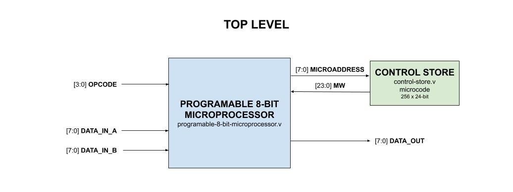
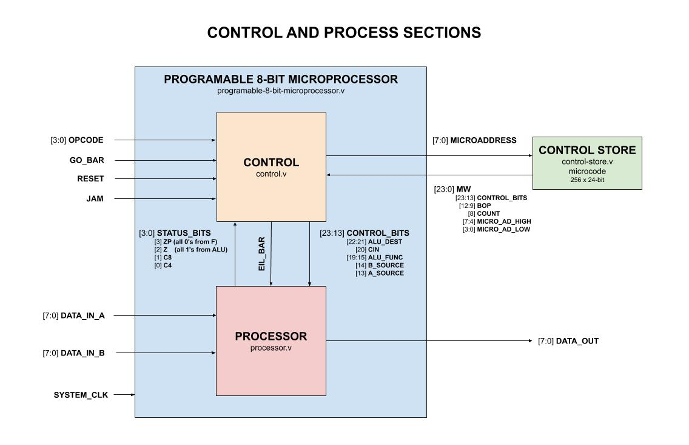
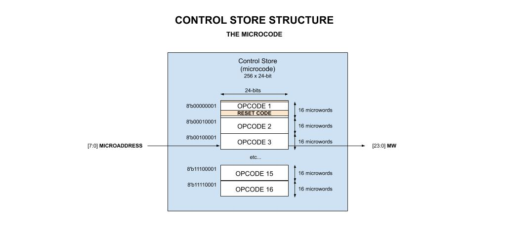
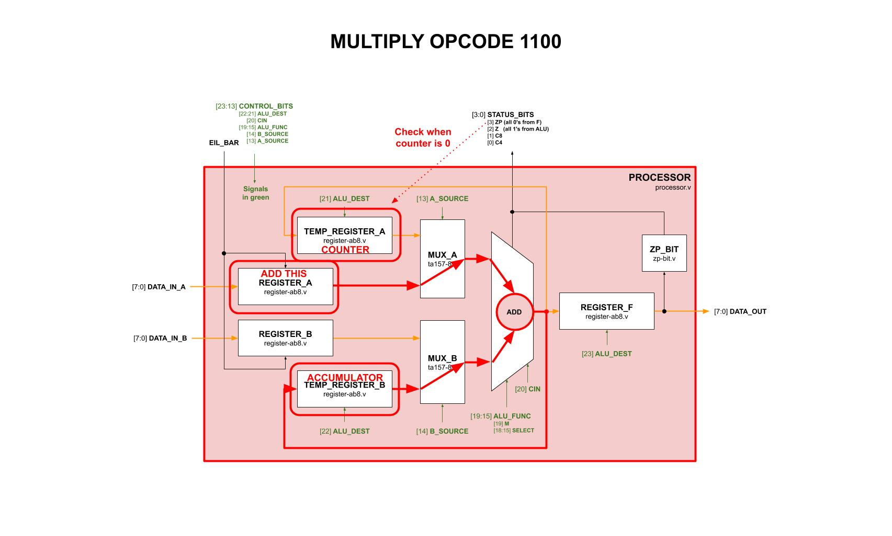
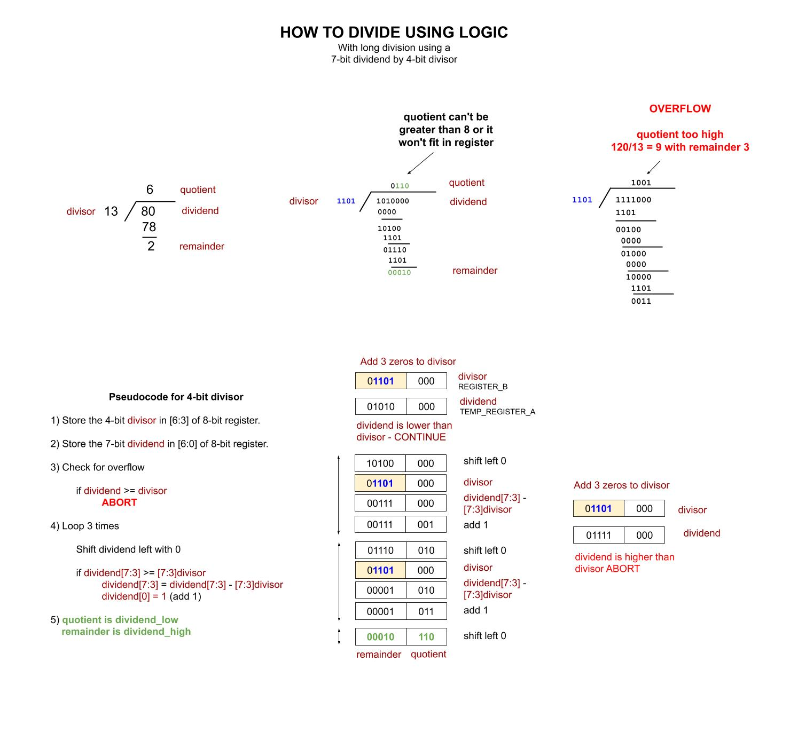
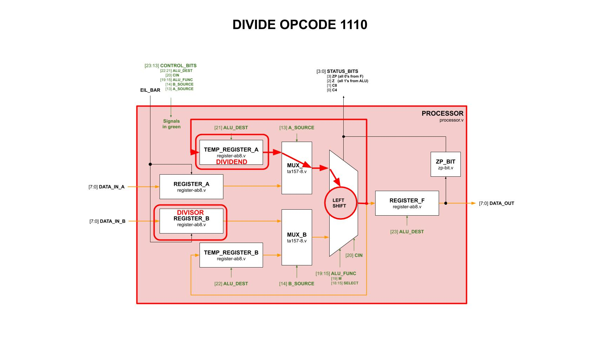
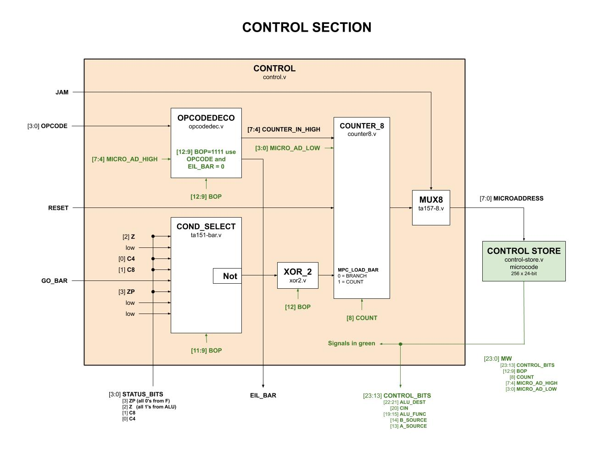
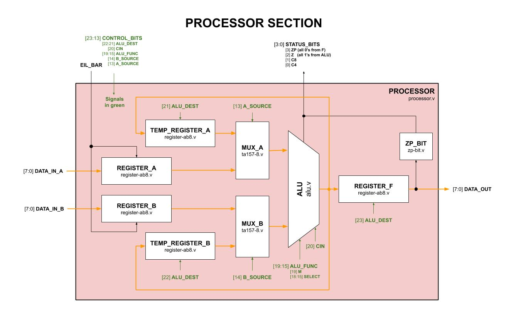
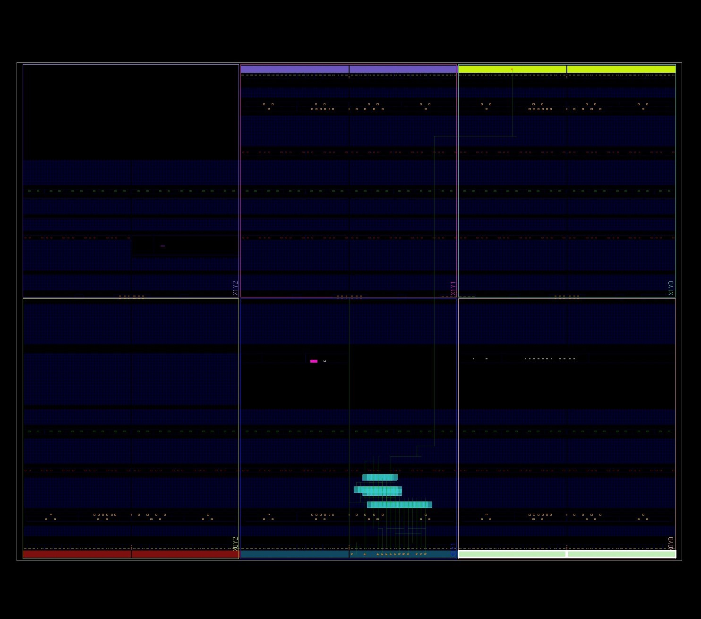

# PROGRAMABLE 8-BIT MICROPROCESSOR EXAMPLE

_A programable 8-bit microprocessor. Originally designed in VHDL for part of
[my Master's Thesis](https://github.com/JeffDeCola/my-masters-thesis)._

Table of Contents

* [OVERVIEW](https://github.com/JeffDeCola/my-verilog-examples/tree/master/systems/microprocessors/programable_8_bit_microprocessor#overview)
* [STATS](https://github.com/JeffDeCola/my-verilog-examples/tree/master/systems/microprocessors/programable_8_bit_microprocessor#stats)
* [TOP LEVEL (HOW IT WORKS)](https://github.com/JeffDeCola/my-verilog-examples/tree/master/systems/microprocessors/programable_8_bit_microprocessor#top-level-how-it-works)
  * [THE CONTROL AND PROCESSOR SECTION](https://github.com/JeffDeCola/my-verilog-examples/tree/master/systems/microprocessors/programable_8_bit_microprocessor#the-control-and-processor-section)
* [OPCODE (THE USER INSTRUCTION SET)](https://github.com/JeffDeCola/my-verilog-examples/tree/master/systems/microprocessors/programable_8_bit_microprocessor#opcode-the-user-instruction-set)
* [MICROCODE (THE INTERNAL INSTRUCTIONS)](https://github.com/JeffDeCola/my-verilog-examples/tree/master/systems/microprocessors/programable_8_bit_microprocessor#microcode-the-internal-instructions)
  * [MICROWORD](https://github.com/JeffDeCola/my-verilog-examples/tree/master/systems/microprocessors/programable_8_bit_microprocessor#microword)
  * [RESET](https://github.com/JeffDeCola/my-verilog-examples/tree/master/systems/microprocessors/programable_8_bit_microprocessor#reset)
  * [ADD (opcode 0011)](https://github.com/JeffDeCola/my-verilog-examples/tree/master/systems/microprocessors/programable_8_bit_microprocessor#add-opcode-0011)
  * [SUBTRACT (opcode 0111)](https://github.com/JeffDeCola/my-verilog-examples/tree/master/systems/microprocessors/programable_8_bit_microprocessor#subtract-opcode-0111)
  * [MULTIPLY (opcode 1100)](https://github.com/JeffDeCola/my-verilog-examples/tree/master/systems/microprocessors/programable_8_bit_microprocessor#multiply-opcode-1100)
  * [DIVIDE (opcode 1110)](https://github.com/JeffDeCola/my-verilog-examples/tree/master/systems/microprocessors/programable_8_bit_microprocessor#divide-opcode-1110)
  * [JAM](https://github.com/JeffDeCola/my-verilog-examples/tree/master/systems/microprocessors/programable_8_bit_microprocessor#jam)
  * [DEFAULT](https://github.com/JeffDeCola/my-verilog-examples/tree/master/systems/microprocessors/programable_8_bit_microprocessor#default)
* [MORE DETAIL (UNDER THE HOOD)](https://github.com/JeffDeCola/my-verilog-examples/tree/master/systems/microprocessors/programable_8_bit_microprocessor#more-detail-under-the-hood)
  * [CONTROL SECTION](https://github.com/JeffDeCola/my-verilog-examples/tree/master/systems/microprocessors/programable_8_bit_microprocessor#control-section)
  * [PROCESSOR SECTION](https://github.com/JeffDeCola/my-verilog-examples/tree/master/systems/microprocessors/programable_8_bit_microprocessor#processor-section)
* [RUN (SIMULATE)](https://github.com/JeffDeCola/my-verilog-examples/tree/master/systems/microprocessors/programable_8_bit_microprocessor#run-simulate)
* [CHECK WAVEFORM](https://github.com/JeffDeCola/my-verilog-examples/tree/master/systems/microprocessors/programable_8_bit_microprocessor#check-waveform)
* [TESTED IN HARDWARE - BURNED TO A FPGA](https://github.com/JeffDeCola/my-verilog-examples/tree/master/systems/microprocessors/programable_8_bit_microprocessor#tested-in-hardware---burned-to-a-fpga)

Logic Used

* [and2](https://github.com/JeffDeCola/my-verilog-examples/tree/master/basic-code/combinational-logic/and2)
  2-input AND gate
* [nand4](https://github.com/JeffDeCola/my-verilog-examples/tree/master/basic-code/combinational-logic/nand4)
  4-input NAND gate
* [nor2](https://github.com/JeffDeCola/my-verilog-examples/tree/master/basic-code/combinational-logic/nor2)
  2-input OR gate
* [not1](https://github.com/JeffDeCola/my-verilog-examples/tree/master/basic-code/combinational-logic/not1)
  NOT gate
* [or2](https://github.com/JeffDeCola/my-verilog-examples/tree/master/basic-code/combinational-logic/or2)
  2-input OR gate
* [xor2](https://github.com/JeffDeCola/my-verilog-examples/tree/master/basic-code/combinational-logic/xor2)
  2-input XOR gate
* [d_flip_flop](https://github.com/JeffDeCola/my-verilog-examples/tree/master/basic-code/sequential-logic/d_flip_flop)
  A positive edge d flip-flop with synchronous enable (Used in jeff_74x377)
* [jk_flip_flop](https://github.com/JeffDeCola/my-verilog-examples/tree/master/basic-code/sequential-logic/jk_flip_flop)
  A positive edge jk flip-flop with synchronous clear (Used in jeff_74x161)
* [jeff_74x181](https://github.com/JeffDeCola/my-verilog-examples/tree/master/combinational-logic/alus/jeff_74x181)
  4-bit alu (arithmetic logic unit) and function generator
* [jeff_74x151](https://github.com/JeffDeCola/my-verilog-examples/tree/master/combinational-logic/multiplexers-and-demultiplexers/jeff_74x151)
  8-line to 1-line data selector/multiplexer
* [jeff_74x157](https://github.com/JeffDeCola/my-verilog-examples/tree/master/combinational-logic/multiplexers-and-demultiplexers/jeff_74x157)
  Quad 2-line to 1-line data selector/multiplexer, non-inverting outputs
* [jeff_74x161](https://github.com/JeffDeCola/my-verilog-examples/tree/master/sequential-logic/counters/jeff_74x161)
  Synchronous presettable 4-bit binary counter, asynchronous clear
* [jeff_74x377](https://github.com/JeffDeCola/my-verilog-examples/tree/master/sequential-logic/registers/jeff_74x377)
  8-bit register, clock enable

## OVERVIEW

As of today I have programmed this microprocessor
to ADD, SUBTRACT, MULTIPLY and DIVIDE.

_I used
[iverilog](https://github.com/JeffDeCola/my-cheat-sheets/tree/master/hardware/tools/simulation/iverilog-cheat-sheet)
to simulate and
[GTKWave](https://github.com/JeffDeCola/my-cheat-sheets/tree/master/hardware/tools/simulation/gtkwave-cheat-sheet)
to view the waveform. I also used
[Xilinx Vivado](https://github.com/JeffDeCola/my-cheat-sheets/tree/master/hardware/tools/synthesis/xilinx-vivado-cheat-sheet)
to synthesize and program this example on a
[Digilent ARTY-S7](https://github.com/JeffDeCola/my-cheat-sheets/tree/master/hardware/development/fpga-development-boards/digilent-arty-s7-cheat-sheet)
FPGA development board._

## STATS

* Build around the
  [74x161](https://github.com/JeffDeCola/my-verilog-examples/tree/master/combinational-logic/alus/jeff_74x181)
  ALU
  * 16 binary arithmetic operations
  * 16 logic operations
  * 4-bit words
* 8-bit data processing
* Up to 16 Opcodes
  * Programable via microcode
    [ADD](https://github.com/JeffDeCola/my-verilog-examples/tree/master/systems/microprocessors/programable_8_bit_microprocessor#add-opcode-0011),
    [SUBTRACT](https://github.com/JeffDeCola/my-verilog-examples/tree/master/systems/microprocessors/programable_8_bit_microprocessor#subtract-opcode-0111),
    [MULTIPLY](https://github.com/JeffDeCola/my-verilog-examples/tree/master/systems/microprocessors/programable_8_bit_microprocessor#multiply-opcode-1100)
    &
    [DIVIDE](https://github.com/JeffDeCola/my-verilog-examples/tree/master/systems/microprocessors/programable_8_bit_microprocessor#divide-opcode-1110)
* Microcode
  * 256 x 24-bit microcode storage
  * 24-bit microword
* Pin count
  * 32 pins if using hardcoded internal microcode
    * 24 Input pins
    * 8 Output pins
  * 64 if using external microcode
    * 48 Input pins
    * 16 Output pins
* Synthesizable verilog code

## TOP LEVEL (HOW IT WORKS)

**Based on an instruction (opcode) this processor takes in data,
processes that data (via the alu and microcode instructions)
and spits out the result. That's about it.**

This may help,



MAIN INPUTS,

* [3:0] **OPCODE** _The instruction like ADD and SUBTRACT_
* [7:0] **DATA_IN_A**
* [7:0] **DATA_IN_B**

OUTPUT,

* [7:0] **DATA_OUT**

OTHER INPUTS,

* **SYSTEM_CLK**  _Clock_
* **GO_BAR** _Active low kicks it off opcode_
* **JAM** _Active high will cause Microaddress to be 8'hff_
* **RESET** _Reset (active low) the counter (opcode 0000)_

### THE CONTROL AND PROCESSOR SECTION

This design is broken into two main sections,

* **TOP**
  ([programable_8_bit_microprocessor.v](https://github.com/JeffDeCola/my-verilog-examples/blob/master/systems/microprocessors/programable_8_bit_microprocessor/programable_8_bit_microprocessor.v))
  * **CONTROL_SECTION**
    ([control.v](https://github.com/JeffDeCola/my-verilog-examples/blob/master/systems/microprocessors/programable_8_bit_microprocessor/control/control.v))
    * The brains. Handles the opcode, microcode and control the process section
  * **PROCESSOR_SECTION**
    ([processor.v](https://github.com/JeffDeCola/my-verilog-examples/blob/master/systems/microprocessors/programable_8_bit_microprocessor/processor/processor.v))
    * Crunches the data controlled by the control section



## OPCODE (THE USER INSTRUCTION SET)

The `opcode` (Operation Code) is the instruction set telling the processor
it what to do. Instructions are implemented in microroutines (i.e. microcode).
In this design there can be up to 16 opcodes.

This is what I have microcoded so far,

* [3:0] **OPCODE**
  * 0011:
    [ADD](https://github.com/JeffDeCola/my-verilog-examples/tree/master/systems/microprocessors/programable_8_bit_microprocessor#add-opcode-0011)
  * 0111:
    [SUBTRACT](https://github.com/JeffDeCola/my-verilog-examples/tree/master/systems/microprocessors/programable_8_bit_microprocessor#subtract-opcode-0111)
  * 1100:
    [MULTIPLY](https://github.com/JeffDeCola/my-verilog-examples/tree/master/systems/microprocessors/programable_8_bit_microprocessor#multiply-opcode-1100)
  * 1110:
    [DIVIDE](https://github.com/JeffDeCola/my-verilog-examples/tree/master/systems/microprocessors/programable_8_bit_microprocessor#divide-opcode-1110)

## MICROCODE (THE INTERNAL INSTRUCTIONS)

The `microcode`are the internal instructions the processor uses
to accomplish the users opcode instruction.

The control section gets the microword **[23:0] MW** using the
**[7:0] MICROADDRESS**. Hence there can be up to 256 x 24-bit microwords.

Each opcode accesses a section of this memory starting at address `8'hX1`.
Hence, there are 16 sections equally divided.

This may help,



### MICROWORD

The 24-bit microword (MW) fields are as follows,

* [23:0] **MW**
  * [3:0] **MICRO_AD_LOW** _Input address into counter_
  * [7:4] **MICRO_AD_HIGH**
  * [8] **COUNT** _Enable Counter to count_
  * [12:9] **BOP** _Branch OPeration for counter that controls counter load_
  * [23:13] CONTROL_BITS
    * [13] **A_SOURCE** _Input to alu (Input reg or Temp reg)_
    * [14] **B_SOURCE**
    * [19:15] **ALU_FUNC** _The alu functions (refer to
      [jeff_74x181](https://github.com/JeffDeCola/my-verilog-examples/tree/master/combinational-logic/alus/jeff_74x181))_
    * [20] **CIN** _Carry input for alu_
    * [23:21] **ALU_DEST** _Output from alu (TEMP_A TEMP_B or F registers)_

The first 13 bits are used in the control sections and the top 13 bits
are used in the process section.

The bits do the following actions,

| FIELD         | BITS     |  MEANING                                        | PNEUMONIC           |
|--------------:|---------:|:------------------------------------------------|---------------------|
| **ALU_DEST**  | 000      | F, TempB, TempA                                 | F_TB_TA             |
|               | 001      | F, TempB                                        | F_TB                |
|               | 010      | F, TempA                                        | F_TA                |
|               | 011      | F                                               | F                   |
|               | 100      | TempB, TempA                                    | TB_TA               |
|               | 101      | TempB                                           | TB                  |
|               | 110      | TempA                                           | TA                  |
|               | **111**  | **Result Not Stored (Default)**                 | NONE (DEFAULT)      |
|               |          |                                                 |                     |
| **CIN**       | 1        | Carry input                                     | CARRY               |
|               | 0        | **No Carry (DEFAULT)**                          | NO_CARRY (DEFAULT)  |
|               |          |                                                 |                     |
| **ALU_FUNC**  | 0 0000   | M=0 ARITH -  A                                  | A                   |
|               | 0 0001   | M=0 ARITH - A+B                                 | A+B                 |
|               | 0 0010   | M=0 ARITH - A+!B                                | A+!B                |
|               | 0 0011   | M=0 ARITH - MINUS 1 (2's compliment)            | MINUS 1             |
|               | 0 0100   | M=0 ARITH - A PLUS A(!B)                        | A PLUS A(!B)        |
|               | 0 0101   | M=0 ARITH - (A+B) PLUS A(!B)                    | (A+B) PLUS A(!B)    |
|               | 0 0110   | M=0 ARITH - A MINUS B MINUS 1                   | A MINUS B MINUS 1   |
|               | 0 0111   | M=0 ARITH - A(!B) MINUS 1                       | A(!B) MINUS 1       |
|               | 0 1000   | M=0 ARITH - A PLUS AB                           | A PLUS AB           |
|               | 0 1001   | M=0 ARITH - A PLUS B                            | A_PLUS_B            |
|               | 0 1010   | M=0 ARITH - (A+!B) PLUS AB                      | (A+!B) PLUS AB      |
|               | 0 1011   | M=0 ARITH - AB MINUS 1                          | AB MINUS 1          |
|               | 0 1100   | M=0 ARITH - A PLUS A (bit shifted)              | A PLUS A (bit shift)|
|               | 0 1101   | M=0 ARITH - (A+B) PLUS A                        | (A+B) PLUS A        |
|               | 0 1110   | M=0 ARITH - (A+!B) PLUS A                       | (A+!B) PLUS A       |
|               | 0 1111   | M=1 ARITH - A MINUS 1                           | A_MINUS_1           |
|               | 1 0000   | M=1 LOGIC - !A                                  | !A                  |
|               | 1 0001   | M=1 LOGIC - !(A+B)                              | !(A+B)              |
|               | 1 0010   | M=1 LOGIC - (!A)B                               | (!A)B               |
|               | 1 0011   | M=1 LOGIC - O                                   | 0                   |
|               | 1 0100   | M=1 LOGIC - !(AB)                               | !(AB)               |
|               | 1 0101   | M=1 LOGIC - !B                                  | !B                  |
|               | 1 0110   | M=1 LOGIC - A^B                                 | A^B                 |
|               | 1 0111   | M=1 LOGIC - A(!B)                               | A(!B)               |
|               | 1 1000   | M=1 LOGIC - !A+B                                | !A+B                |
|               | 1 1001   | M=1 LOGIC - !(A^B)                              | !(A^B)              |
|               | 1 1010   | M=1 LOGIC - B                                   | B                   |
|               | 1 1011   | M=1 LOGIC - AB                                  | AB                  |
|               | 1 1100   | M=1 LOGIC - **1 (DEFAULT)**                     | 1 (DEFAULT)         |
|               | 1 1101   | M=1 LOGIC - A+!B                                | A+!B                |
|               | 1 1110   | M=1 LOGIC - A+B                                 | A+B                 |
|               | 1 1111   | M=1 LOGIC - A                                   | A                   |
|               |          |                                                 |                     |
| **B_SOURCE**  | **0**    | **Temp reg drives ALU (DEFAULT)**               | TEMP_B (DEFAULT)    |
|               | 1        | Input reg drives ALU                            | INPUT_B             |
|               |          |                                                 |                     |
| **A_SOURCE**  | **0**    | **Temp reg drives ALU (DEFAULT)**               | TEMP_A (DEFAULT)    |
|               | 1        | Input reg drives ALU                            | INPUT_A             |
|               |          |                                                 |                     |
| **BOP**       | 0 000    | Branch on Z (all 1's from ALU)                  | Z (all 1's from alu)|
|               | 0 001    | COUNT - low                                     | COUNT               |
|               | 0 010    | Branch if C4                                    | C4                  |
|               | 0 011    | Branch if C8                                    | C8                  |
|               | 0 100    | Branch if G0_BAR                                | GO_BAR              |
|               | 0 101    | Branch if ZP | ZP (all 0's from F)              | ZP (all O's from F) |
|               | 0 110    | COUNT - low - **(DEFAULT)**                     | COUNT (DEFAULT)     |
|               | 0 111    | COUNT - low                                     | COUNT               |
|               | 1 000    | Branch if !Z (all 1's from ALU)                 | !Z (all 1s from alu)|
|               | 1 001    | Branch Always - low                             | BRANCH              |
|               | 1 010    | Branch if !C4                                   | !C4                 |
|               | 1 011    | Branch if !C8                                   | !C8                 |
|               | 1 100    | Branch if !G0_BAR                               | !GO_BAR             |
|               | 1 101    | Branch if !ZP | !ZP (all 0's from F)            | !ZP (all O's from F)|
|               | 1 110    | Branch Always - low                             | BRANCH              |
|               | 1 111    | Branch on OPCODE (This also loads input Reg)    | OPCODE (LOADS A,B)  |
|               |          |                                                 |                     |
| **COUNT**     | **1**    | **Counter will count if not loaded (DEFAULT)**  | COUNT_IF_NO_LD (D)  |
|               | 0        | Counter will not count                          | NO_COUNT            |

The microcode is located in
[control-store.v](https://github.com/JeffDeCola/my-verilog-examples/blob/master/systems/microprocessors/programable_8_bit_microprocessor/control-store/control-store.v).

### RESET

When RESET is pressed the processor will be put into a known
state and wait for go.
We use address 0000 since the counter is reset to 0000.
For some indication it's working correctly it also outputs 8'h11 to DATA_OUT
(i.e. the F register) to show it's in a wait state.

| ADDR | ALU_DEST | CIN | ALU_FUNC    | B_SOURCE | A_SOURCE |  BOP    | COUNT | ADDR |
|-----:|:--------:|:---:|:-----------:|:--------:|:--------:|:-------:|:-----:|:----:|
| 00   | F        |  0  | 1           |  X        | X       | BRANCH  |   1   | OB   |
| 0B   | TB_TA    |  0  | 1           |  X        | X       | COUNT   |   1   | XX   |
| 0C   | F        |  0  | 0           |  X        | X       | COUNT   |   1   | XX   |
| OD   | F        |  0  | 1           |  X        | X       | G0_BAR  |   1   | OD   |
| OE   | F        |  0  | 1           |  X        | X       | OPCODE  |   1   | X1   |

### ADD (opcode 0011)

This will add A PLUS B. T The microcode is,

| ADDR | ALU_DEST | CIN | ALU_FUNC    | B_SOURCE | A_SOURCE |  BOP    | COUNT | ADDR |
|-----:|:--------:|:---:|:-----------:|:--------:|:--------:|:-------:|:-----:|:----:|
| 31   | F        |  0  | A_PLUS_B    | INPUT_B  | INPUT_A  | COUNT   |   1   | XX   |
| 32   | NONE     |  0  | 1           | X        | X        | !GO_BAR |   1   | 32   |
| 33   | F        |  0  | 0           | X        | X        | BRANCH  |   1   | 0D   |

### SUBTRACT (opcode 0111)

This will subtract A MINUS B. The microcode is,

| ADDR | ALU_DEST | CIN | ALU_FUNC    | B_SOURCE | A_SOURCE |  BOP    | COUNT | ADDR |
|-----:|:--------:|:---:|:-----------:|:--------:|:--------:|:-------:|:-----:|:----:|
| 71   | F        |  1  | A_MINUS_B   | INPUT_B  | INPUT_A  | COUNT   |   1   | XX   |
| 72   | NONE     |  0  | 1           | X        | X        | !GO_BAR |   1   | 72   |
| 73   | F        |  0  | 0           | X        | X        | BRANCH  |   1   | 0D   |

### MULTIPLY (opcode 1100)

This will multiply A TIMES B. Keep the numbers small to fit into 8-bits.

The microcode is,

| ADDR | ALU_DEST | CIN | ALU_FUNC    | B_SOURCE | A_SOURCE |  BOP    | COUNT | ADDR |
|-----:|:--------:|:---:|:-----------:|:--------:|:--------:|:-------:|:-----:|:----:|
| C1   | TB       |  0  | 0           | X        | X        | COUNT   |   1   | XX   |
| C2   | F        |  0  | B           | INPUT_B  | X        | COUNT   |   1   | XX   |
| C3   | TA       |  0  | B           | INPUT_B  | X        | !ZP     |   1   | C7   |
| C4   | F_TA     |  0  | A_MINUS_1   | X        | TEMP_A   | COUNT   |   1   | XX   |
| C5   | TB       |  0  | A_PLUS_B    | TEMP_B   | INPUT_A  | COUNT   |   1   | XX   |
| C6   | F_TA     |  0  | A_MINUS_1   | X        | TEMP_A   | ZP      |   1   | C5   |
| C7   | F        |  0  | B           | TEMP_B   | X        | !GO_BAR |   1   | C7   |
| C8   | F        |  0  | 0           | X        | X        | BRANCH  |   1   | 0D   |

This may help,



### DIVIDE (opcode 1110)

This will divide a 7-bit **dividend** A from a 4-bit **divisor** B.
The **quotient** will be the lower 3 bits and the **remainder**
will be the upper 5 bits of the output.

Some limits & rules:

* DIVIDEND
  * 7-bits
  * Use DATA_IN_A[6:0]
  * Can be between decimal 1-127 (8'b0000000-8'b01111111)
* DIVISOR
  * 4-bits
  * Use DATA_IN_B[6:3] (Add 3 zeros to bottom bits)
  * Can be between decimal 1-15 (8'b0001-8'b1111)
* QUOTIENT
  * DATA_OUT[2:0]
* REMAINDER
  * DATA_OUT[7:3]
* OVERFLOW
  * Occurs when quotient is greater than 16
  * DATA_OUT will be 8'hFF.

As an example, if you want to divide 80 (7'b1010000) by 13 (4'b1101).
The answer is quotient 6 with a remainder of 2,

* DATA_IN_A = 8'b01010000 (DIVIDEND)
* DATA_IN_B = 8'b01101000 (DIVISOR)
* DATA_OUT
  * DATA_OUT[7:3] = 00010 (REMAINDER) 2
  * DATA_OUT[2:0] = 110 (QUOTIENT) 6

The microcode is,

| ADDR | ALU_DEST | CIN | ALU_FUNC    | B_SOURCE | A_SOURCE |  BOP    | COUNT | ADDR |
|-----:|:--------:|:---:|:-----------:|:--------:|:--------:|:-------:|:-----:|:----:|
| E1   | TA       | 0   | A           | X        | INPUT_A  | COUNT   | 1     | XX   |
| E2   | NONE     | 1   | A_MINUS_B_1 | INPUT_B  | TEMP_A   | C8      | 1     | F0   |
|      |          |     |             |          |          |         |       |      |
| E3   | TA       | 0   | A PLUS A sh | X        | TEMP_A   | COUNT   | 1     | XX   |
| E4   | NONE     | 1   | A_MINUS_B_1 | INPUT_B  | TEMP_A   | !C8     | 1     | E7   |
| E5   | TA       | 1   | A_MINUS_B_1 | INPUT_B  | TEMP_A   | COUNT   | 1     | XX   |
| E6   | TA       | 1   | A           | X        | TEMP_A   | COUNT   | 1     | XX   |
|      |          |     |             |          |          |         |       |      |
| E7   | TA       | 0   | A PLUS A sh | X        | TEMP_A   | COUNT   | 1     | XX   |
| E8   | NONE     | 1   | A_MINUS_B_1 | INPUT_B  | TEMP_A   | !C8     | 1     | EB   |
| E9   | TA       | 1   | A_MINUS_B_1 | INPUT_B  | TEMP_A   | COUNT   | 1     | XX   |
| EA   | TA       | 1   | A           | X        | TEMP_A   | COUNT   | 1     | XX   |
|      |          |     |             |          |          |         |       |      |
| EB   | TA       | 0   | A PLUS A sh | X        | TEMP_A   | COUNT   | 1     | XX   |
| EC   | NONE     | 1   | A_MINUS_B_1 | INPUT_B  | TEMP_A   | !C8     | 1     | EF   |
| ED   | TA       | 1   | A_MINUS_B_1 | INPUT_B  | TEMP_A   | COUNT   | 1     | XX   |
| EE   | TA       | 1   | A           | X        | TEMP_A   | COUNT   | 1     | XX   |
|      |          |     |             |          |          |         |       |      |
| EF   | F        | 0   | A           | X        | TEMP_A   | BRANCH  | 1     | F1   |
|      |          |     |             |          |          |         |       |      |
| F0   | F        | 0   | 1           | X        | X        | COUNT   | 1     | XX   |
| F1   | NONE     | 0   | A           | X        | X        | !GO_BAR | 1     | F1   |
| F2   | F        | 0   | 0           | X        | X        | BRANCH  | 1     | 0D   |

These diagrams may help,





### JAM

This microword address is accessed when the JAM input signal is enabled.
It will hold 8'hFF as long as JAM is enabled.  When released
it will flash a few times and heads back to the start of RESET.

| ADDR | ALU_DEST | CIN | ALU_FUNC    | B_SOURCE | A_SOURCE |  BOP    | COUNT | ADDR |
|-----:|:--------:|:---:|:-----------:|:--------:|:--------:|:-------:|:-----:|:----:|
| FF   | F        |  0  | 1           | X        | X        | BRANCH  |   1   | F6   |
| F6   | F        |  0  | 0           | X        | X        | COUNT   |   1   | XX   |
| F7   | F        |  0  | 1           | X        | X        | COUNT   |   1   | XX   |
| F8   | F        |  0  | 0           | X        | X        | COUNT   |   1   | XX   |
| F9   | F        |  0  | 1           | X        | X        | COUNT   |   1   | XX   |
| FA   | F        |  0  | 0           | X        | X        | COUNT   |   1   | XX   |
| FB   | F        |  0  | 1           | X        | X        | COUNT   |   1   | XX   |
| FC   | F        |  0  | 0           | X        | X        | COUNT   |   1   | XX   |
| FD   | F        |  0  | 1           | X        | X        | COUNT   |   1   | XX   |
| FE   | F        |  0  | 0           | X        | X        | BRANCH  |   1   | 00   |

### DEFAULT

If system runs into trouble, it will default to this and send back to RESET.

| ADDR | ALU_DEST | CIN | ALU_FUNC    | B_SOURCE | A_SOURCE |  BOP    | COUNT | ADDR |
|-----:|:--------:|:---:|:-----------:|:--------:|:--------:|:-------:|:-----:|:----:|
| deflt| F        |  0  | 1           | X        | X        | BRANCH  |   1   | 00   |

## MORE DETAIL (UNDER THE HOOD)

Here is a little more detail of the control and processor sections.

### CONTROL SECTION

The control section has five main parts,

* **CONTROL_SECTION**
  ([control.v](https://github.com/JeffDeCola/my-verilog-examples/blob/master/systems/microprocessors/programable_8_bit_microprocessor/control/control.v))
  * **COUNTER_8**
    ([counter8.v](https://github.com/JeffDeCola/my-verilog-examples/blob/master/systems/microprocessors/programable_8_bit_microprocessor/core-parts/counter8.v))
    * COUNTER1
      ([ta161-bar.v](https://github.com/JeffDeCola/my-verilog-examples/blob/master/systems/microprocessors/programable_8_bit_microprocessor/core-parts/ta161-bar.v))
      * [jeff_74x161](https://github.com/JeffDeCola/my-verilog-examples/blob/master/sequential-logic/counters/jeff_74x161/jeff_74x161.v)
        _replaced ta161_
        * [jk_flip_flop](https://github.com/JeffDeCola/my-verilog-examples/blob/master/basic-code/sequential-logic/jk_flip_flop/jk_flip_flop.v)
    * COUNTER2
      ([ta161-bar.v](https://github.com/JeffDeCola/my-verilog-examples/blob/master/systems/microprocessors/programable_8_bit_microprocessor/core-parts/ta161-bar.v))
      * [jeff_74x161](https://github.com/JeffDeCola/my-verilog-examples/blob/master/sequential-logic/counters/jeff_74x161/jeff_74x161.v)
        _replaced ta161_
        * [jk_flip_flop](https://github.com/JeffDeCola/my-verilog-examples/blob/master/basic-code/sequential-logic/jk_flip_flop/jk_flip_flop.v)
  * **MUX8**
    ([ta157-8.v](https://github.com/JeffDeCola/my-verilog-examples/blob/master/systems/microprocessors/programable_8_bit_microprocessor/core-parts/ta157-8.v))
    * [jeff_74x157](https://github.com/JeffDeCola/my-verilog-examples/tree/master/combinational-logic/multiplexers-and-demultiplexers/jeff_74x157/jeff_74x157.v)
      _replaced ta157_bar & ta157_
  * **OPCODEDECO**
    ([opcodedec.v](https://github.com/JeffDeCola/my-verilog-examples/blob/master/systems/microprocessors/programable_8_bit_microprocessor/opcode/opcodedec.v))
    * U1
      ([ta157-4.v](https://github.com/JeffDeCola/my-verilog-examples/blob/master/systems/microprocessors/programable_8_bit_microprocessor/core-parts/ta157-4.v))
      * [jeff_74x157](https://github.com/JeffDeCola/my-verilog-examples/tree/master/combinational-logic/multiplexers-and-demultiplexers/jeff_74x157/jeff_74x157.v)
        _replaced ta157_bar_
    * U2
      ([nand4.v](https://github.com/JeffDeCola/my-verilog-examples/blob/master/basic-code/combinational-logic/nand4/nand4.v))
      _replaced nand4_
  * **COND_SELECT**
    ([ta151-bar.v](https://github.com/JeffDeCola/my-verilog-examples/blob/master/systems/microprocessors/programable_8_bit_microprocessor/core-parts/ta151-bar.v))
    * [jeff_74x151](https://github.com/JeffDeCola/my-verilog-examples/blob/master/combinational-logic/multiplexers-and-demultiplexers/jeff_74x151/jeff_74x151.v)
      _replaced ta151_
  * **XOR_2**
    ([xor2.v](https://github.com/JeffDeCola/my-verilog-examples/blob/master/basic-code/combinational-logic/xor2/xor2.v))
    _replaced xor2_



### PROCESSOR SECTION

The processor is a collection of registers, muxes and an alu,

* **PROCESSOR_SECTION**
  ([processor.v](https://github.com/JeffDeCola/my-verilog-examples/blob/master/systems/microprocessors/programable_8_bit_microprocessor/processor/processor.v))
  * **REGISTERA**
    ([register-ab8.v](https://github.com/JeffDeCola/my-verilog-examples/blob/master/systems/microprocessors/programable_8_bit_microprocessor/core-parts/register-ab8.v))
    * OR1
      ([or2.v](https://github.com/JeffDeCola/my-verilog-examples/blob/master/basic-code/combinational-logic/or2/or2.v))
      _replaced or2_
    * DFFS
      ([ta377-bar.v](https://github.com/JeffDeCola/my-verilog-examples/blob/master/systems/microprocessors/programable_8_bit_microprocessor/core-parts/ta377-bar.v))
      * [jeff_74x377](https://github.com/JeffDeCola/my-verilog-examples/blob/master/sequential-logic/registers/jeff_74x377/jeff_74x377.v)
        _replaced ta377_
        * [d_flip_flop](https://github.com/JeffDeCola/my-verilog-examples/blob/master/basic-code/sequential-logic/d_flip_flop/d_flip_flop.v)
  * **REGISTERB**
    ([register-ab8.v](https://github.com/JeffDeCola/my-verilog-examples/blob/master/systems/microprocessors/programable_8_bit_microprocessor/core-parts/register-ab8.v))
    _See above_
  * **TEMP_REGISTER_A**
    ([register-ab8.v](https://github.com/JeffDeCola/my-verilog-examples/blob/master/systems/microprocessors/programable_8_bit_microprocessor/core-parts/register-ab8.v))
    _See above_
  * **TEMP_REGISTER_B**
    ([register-ab8.v](https://github.com/JeffDeCola/my-verilog-examples/blob/master/systems/microprocessors/programable_8_bit_microprocessor/core-parts/register-ab8.v))
    _See above_
  * **MUX_A**
    ([ta157-8.v](https://github.com/JeffDeCola/my-verilog-examples/blob/master/systems/microprocessors/programable_8_bit_microprocessor/core-parts/ta157-8.v))
    * [jeff_74x157](https://github.com/JeffDeCola/my-verilog-examples/tree/master/combinational-logic/multiplexers-and-demultiplexers/jeff_74x157/jeff_74x157.v)
      _replaced ta157_bar_
  * **MUX_B**
    ([ta157-8.v](https://github.com/JeffDeCola/my-verilog-examples/blob/master/systems/microprocessors/programable_8_bit_microprocessor/core-parts/ta157-8.v))
    * [jeff_74x157](https://github.com/JeffDeCola/my-verilog-examples/tree/master/combinational-logic/multiplexers-and-demultiplexers/jeff_74x157/jeff_74x157.v)
      _replaced ta157_bar_
  * **ALU1**
    ([alu.v](https://github.com/JeffDeCola/my-verilog-examples/blob/master/systems/microprocessors/programable_8_bit_microprocessor/alu/alu.v))
    * U1
      ([ta181-bar.v](https://github.com/JeffDeCola/my-verilog-examples/blob/master/systems/microprocessors/programable_8_bit_microprocessor/core-parts/ta181-bar.v))
      * [jeff_74x181](https://github.com/JeffDeCola/my-verilog-examples/blob/master/combinational-logic/alus/jeff_74x181/jeff_74x181.v)
        _replaced ta181_
      * [not1](https://github.com/JeffDeCola/my-verilog-examples/blob/master/basic-code/combinational-logic/not1/not1.v)
        _replaced inv_
    * U2
      ([ta181-bar.v](https://github.com/JeffDeCola/my-verilog-examples/blob/master/systems/microprocessors/programable_8_bit_microprocessor/core-parts/ta181-bar.v))
      * [jeff_74x181](https://github.com/JeffDeCola/my-verilog-examples/blob/master/combinational-logic/alus/jeff_74x181/jeff_74x181.v)
        _replaced ta181_
      * [not1](https://github.com/JeffDeCola/my-verilog-examples/blob/master/basic-code/combinational-logic/not1/not1.v)
        _replaced inv_
    * AND1
      ([and2.v](https://github.com/JeffDeCola/my-verilog-examples/blob/master/basic-code/combinational-logic/and2/and2.v))
      _replaced and2_
  * **F_REGISTER**
    ([register-ab8.v](https://github.com/JeffDeCola/my-verilog-examples/blob/master/systems/microprocessors/programable_8_bit_microprocessor/core-parts/register-ab8.v))
    _See above_
  * **ZP_BIT1**
    ([zp-bit.v](https://github.com/JeffDeCola/my-verilog-examples/blob/master/systems/microprocessors/programable_8_bit_microprocessor/core-parts/zp-bit.v))
    * U1, U2, U3, U4 ([nor2.v](https://github.com/JeffDeCola/my-verilog-examples/blob/master/basic-code/combinational-logic/nor2/nor2.v))
      _Replaced nor2_
    * U5 ([nand4.v](https://github.com/JeffDeCola/my-verilog-examples/blob/master/basic-code/combinational-logic/nand4/nand4.v))
      _Replaced nand4_



## VERILOG CODE

The
[programable-8-bit-microprocessor.v](https://github.com/JeffDeCola/my-verilog-examples/blob/master/systems/pipelines/programable-8-bit-microprocessor/programable-8-bit-microprocessor.v)
top level code is,

```verilog
    // CONTROL_SECTION
    control CONTROL_SECTION (
        .OPCODE(OPCODE),
        .GO_BAR(GO_BAR),
        .RESET(RESET),
        .JAM(JAM),
        .SYSTEM_CLK(SYSTEM_CLK),
        .STATUS_BITS(STATUS_BITS),
        .MW(MW),
        .MICROADDRESS(MICROADDRESS),
        .CONTROL_BITS(CONTROL_BITS),        // ORDER DIFFERENT FROM THESIS
        .EIL_BAR(EIL_BAR)
    );

    // PROCESSOR SECTION
    processor PROCESSOR_SECTION (
        .DATA_IN_A(DATA_IN_A),
        .DATA_IN_B(DATA_IN_B),
        .SYSTEM_CLK(SYSTEM_CLK),
        .EIL_BAR(EIL_BAR),
        .CONTROL_BITS(CONTROL_BITS),
        .STATUS_BITS(STATUS_BITS),
        .DATA_OUT(DATA_OUT)
    );
```

## RUN (SIMULATE)

The testbench uses two files,

* [programable-8-bit-microprocessor_tb.v](https://github.com/JeffDeCola/my-verilog-examples/blob/master/systems/pipelines/programable-8-bit-microprocessor/programable-8-bit-microprocessor_tb.v)
  the testbench
* [programable-8-bit-microprocessor_tb.tv](https://github.com/JeffDeCola/my-verilog-examples/blob/master/systems/pipelines/programable-8-bit-microprocessor/programable-8-bit-microprocessor_tb.tv)
  the test vectors and expected results

with,

* [programable-8-bit-microprocessor.vh](https://github.com/JeffDeCola/my-verilog-examples/blob/master/systems/pipelines/programable-8-bit-microprocessor/programable-8-bit-microprocessor.vh)
  is the header file listing the verilog models
* [run-simulation.sh](https://github.com/JeffDeCola/my-verilog-examples/blob/master/systems/pipelines/programable-8-bit-microprocessor/run-simulation.sh)
  is a script containing the commands below

Use **iverilog** to compile the verilog to a vvp format
which is used by the vvp runtime simulation engine,

```bash
iverilog -o programable-8-bit-microprocessor_tb.vvp programable-8-bit-microprocessor_tb.v programable-8-bit-microprocessor.vh
```

Use **vvp** to run the simulation, which checks the UUT
and creates a waveform dump file *.vcd.

```bash
vvp programable-8-bit-microprocessor_tb.vvp
```

For this test I will ????? (LIST TESTS IN TEST VECTOR FILE)

```text
        // ******************************************************
        // TEST 1 - ADD - 8'h31 PLUS 8'h05 = 8'h36 (49 + 5 = 54)
        OPCODE = 4'b0011;
        GO_BAR = 0;
        DATA_IN_A = 8'h31;
        DATA_IN_B = 8'h05;

        // ******************************************************
        // TEST 2 - SUBTRACT - 8'h31 MINUS 8'h05 = 8'h2C (49 - 5 = 44)
        OPCODE = 4'b0111;
        GO_BAR = 0;
        DATA_IN_A = 8'h31;
        DATA_IN_B = 8'h05;

        // ******************************************************
        // TEST 3 - MULTIPLY - 8'h31 x 8'h05 = 8'hF5 (49 x 5 = 245)
        OPCODE = 4'b1100;
        GO_BAR = 0;
        DATA_IN_A = 8'h31;
        DATA_IN_B = 8'h05;

        // ******************************************************
        // TEST 4 - DIVIDE - 8'h50 / 8'h0D = 8'h06 with remainder 8'h02
        // (49 / 13 = 6 with 2 remainder)
        // THE OUTPUT WILL BE 8'b00010 110 or 8'h16
        OPCODE = 4'b1110;
        GO_BAR = 0;
        DATA_IN_A = 8'h50;      // DIVIDEND (MUST BE LOWER THAN DIVISOR)
        DATA_IN_B = 8'h68;      // DIVISOR (MUST ADD 3 LEADING ZEROS) 1101 becomes 1101000

        // ******************************************************
        // TEST 5 - DIVIDE - 8'h2D / 8'h0B = 8'h0B with remainder 8'b01
        // (45 / 11 = 4 with 1 remainder)
        // THE OUTPUT WILL BE 8'b00001 100 or 8'h0C
        OPCODE = 4'b1110;
        GO_BAR = 0;
        DATA_IN_A = 8'h2D;      // DIVIDEND (MUST BE LOWER THAN DIVISOR)
        DATA_IN_B = 8'h58;      // DIVISOR (MUST ADD 3 LEADING ZEROS) 1011 becomes 01011000

        // ******************************************************
        // TEST 6 - DIVIDE - 8'h4E / 8'h0F = 8'h05 with remainder 8'b03
        // (78 / 15 = 5 with 3 remainder)
        // THE OUTPUT WILL BE 8'b00011 101 or 8'h1D
        OPCODE = 4'b1110;
        GO_BAR = 0;
        DATA_IN_A = 8'h4E;      // DIVIDEND (MUST BE LOWER THAN DIVISOR)
        DATA_IN_B = 8'h78;      // DIVISOR (MUST ADD 3 LEADING ZEROS) 1111 becomes 01111000
```

The output of the test,

```text
???
```

## VIEW WAVEFORM

Open the waveform file programable-8-bit-microprocessor_tb.vcd file with GTKWave,

```bash
gtkwave -f programable-8-bit-microprocessor_tb.vcd &
```

Save your waveform to a .gtkw file.

Now you can use the script
[launch-gtkwave.sh](https://github.com/JeffDeCola/my-verilog-examples/blob/master/launch-GTKWave-script/launch-gtkwave.sh)
anytime you want,

```bash
gtkwave -f programable-8-bit-microprocessor_tb.gtkw &
```

Focus on DATA_IN_A, DATA_IN_B and DATA_OUT. You can see the RESET where the
output flashes 00. You can also see the ADD, SUBTRACT AND MULTIPLY operations,


A little more detail,


## TESTED IN HARDWARE - BURNED TO A FPGA

The above code was synthesized using the
[Xilinx Vivado](https://github.com/JeffDeCola/my-cheat-sheets/tree/master/hardware/tools/synthesis/xilinx-vivado-cheat-sheet)
IDE software suite and burned to a FPGA development board.

The ARTY-S7 uses the Xilinx Spartan-7 FPGA (XC7S50) that has
52,160 logic cells and 250 pins. I used about 7% of the total real estate,
that light blue area at the bottom of the die,


