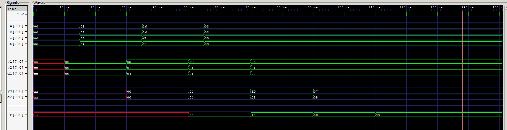

# simple-pipeline example

_A simple pipeline._

[GitHub Webpage](https://jeffdecola.github.io/my-systemverilog-examples/)

## SCHEMATIC

Pipeline the following into 3 stages,

```txt
    F = ((A+B) + (C-D)) * D
```

Hence,

```txt
    STAGE 1 Y1 = A + B, Y2 = C - D, D1 = D

    STAGE 2 Y3 = Y1 + Y2, D2 = D1

    STAGE 3 F = Y3 * D2
```

This may help,


## VERILOG CODE

The main part of the code is,

```verilog
    // STAGE 1
    always @ (posedge clk) begin
        y1 <= a + b;
        y2 <= c - d;
        d1 <= d;
    end

    // STAGE 2
    always @ (posedge clk) begin
        y3 <= y1 + y2;
        d2 <=  d1;
    end

    // STAGE 3
    always @ (posedge clk) begin
        f = y3 * d2;
    end
```

The entire code is
[simple-pipeline.v](simple-pipeline.v).

## RUN (SIMULATE)

I used my testbench
[simple-pipeline-tb.v](simple-pipeline-tb.v) with
[iverilog](https://github.com/JeffDeCola/my-cheat-sheets/tree/master/hardware/tools/simulation/iverilog-cheat-sheet)
to simulate and create a `.vcd` file.

```bash
sh run-test.sh
```

## CHECK WAVEFORM

Check you waveform using your `.vcd` file with a waveform viewer.

I used [GTKWave](https://github.com/JeffDeCola/my-cheat-sheets/tree/master/hardware/tools/simulation/gtkwave-cheat-sheet)
and launch it using
[launch-gtkwave.sh](launch-gtkwave.sh).



## TESTED IN HARDWARE - BURNED TO A FPGA

To test my design in real hardware, the above code was synthesized using the
[Xilinx Vivado](https://github.com/JeffDeCola/my-cheat-sheets/tree/master/hardware/tools/synthesis/xilinx-vivado-cheat-sheet)
IDE software suite and burned to a FPGA development board.
