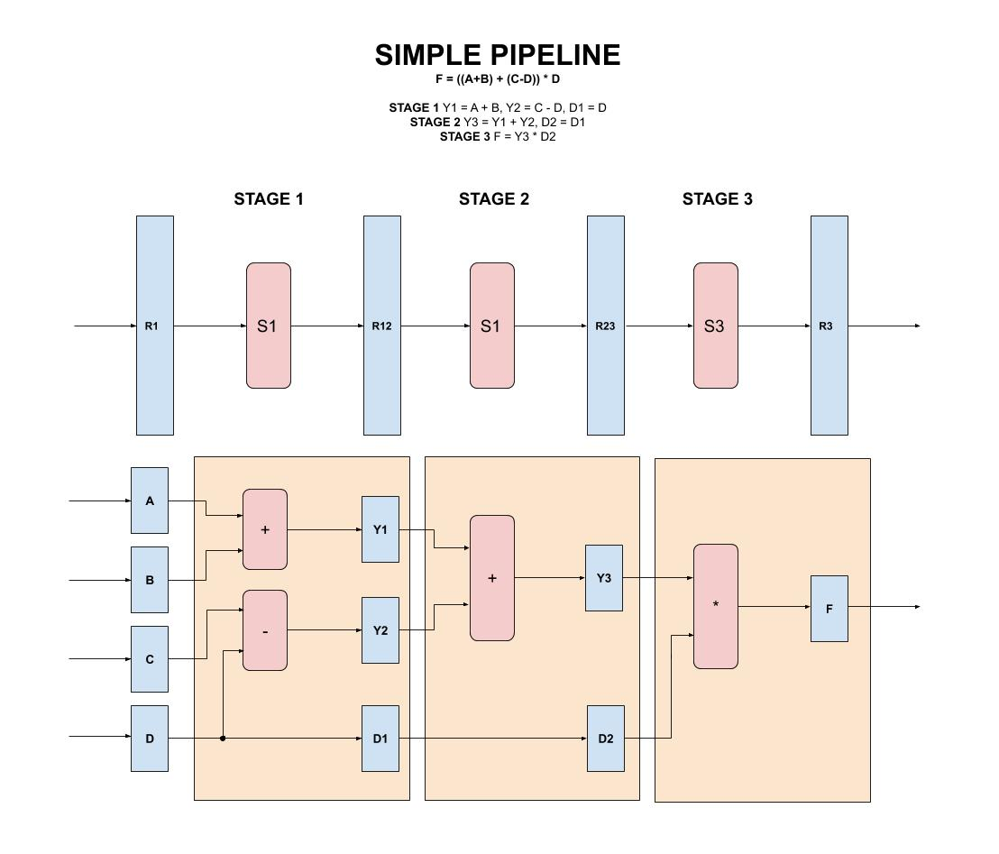
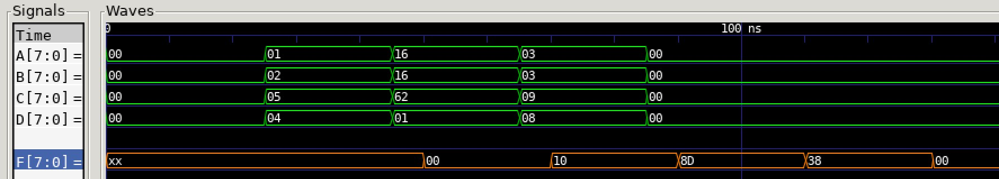

# SIMPLE PIPELINE EXAMPLE

_A simple pipeline._

Table of Contents

* [OVERVIEW](https://github.com/JeffDeCola/my-verilog-examples/tree/master/systems/pipelines/simple_pipeline#overview)
* [SCHEMATIC](https://github.com/JeffDeCola/my-verilog-examples/tree/master/systems/pipelines/simple_pipeline#schematic)
* [VERILOG CODE](https://github.com/JeffDeCola/my-verilog-examples/tree/master/systems/pipelines/simple_pipeline#verilog-code)
* [RUN (SIMULATE)](https://github.com/JeffDeCola/my-verilog-examples/tree/master/systems/pipelines/simple_pipeline#run-simulate)
* [VIEW WAVEFORM](https://github.com/JeffDeCola/my-verilog-examples/tree/master/systems/pipelines/simple_pipeline#view-waveform)
* [TESTED IN HARDWARE - BURNED TO A FPGA](https://github.com/JeffDeCola/my-verilog-examples/tree/master/systems/pipelines/simple_pipeline#tested-in-hardware---burned-to-a-fpga)

## OVERVIEW

Pipeline the following into 3 stages,

```txt
    F = ((A+B) + (C-D)) * D
```

Hence,

```txt
    STAGE 1 Y1 = A + B, Y2 = C - D, D1 = D

    STAGE 2 Y3 = Y1 + Y2, D2 = D1

    STAGE 3 F = Y3 * D2
```

_I used
[iverilog](https://github.com/JeffDeCola/my-cheat-sheets/tree/master/hardware/tools/simulation/iverilog-cheat-sheet)
to simulate and
[GTKWave](https://github.com/JeffDeCola/my-cheat-sheets/tree/master/hardware/tools/simulation/gtkwave-cheat-sheet)
to view the waveform. I also used
[Xilinx Vivado](https://github.com/JeffDeCola/my-cheat-sheets/tree/master/hardware/tools/synthesis/xilinx-vivado-cheat-sheet)
to synthesize and program this example on a
[Digilent ARTY-S7](https://github.com/JeffDeCola/my-cheat-sheets/tree/master/hardware/development/fpga-development-boards/digilent-arty-s7-cheat-sheet)
FPGA development board._

## SCHEMATIC

This may help,



## VERILOG CODE

The
[simple_pipeline.v](https://github.com/JeffDeCola/my-verilog-examples/blob/master/systems/pipelines/simple_pipeline/simple_pipeline.v)
uses behavioral modeling,

```verilog
    reg [7:0] y1, y2, y3, d1, d2;

    // STAGE 1
    // ALWAYS BLOCK with NON-BLOCKING PROCEDURAL ASSIGNMENT STATEMENT
    always @ (posedge clk) begin
        y1 <= a + b;
        y2 <= c - d;
        d1 <= d;
    end

    // STAGE 2
    // ALWAYS BLOCK with NON-BLOCKING PROCEDURAL ASSIGNMENT STATEMENT
    always @ (posedge clk) begin
        y3 <= y1 + y2;
        d2 <=  d1;
    end

    // STAGE 3
    // ALWAYS BLOCK with NON-BLOCKING PROCEDURAL ASSIGNMENT STATEMENT
    always @ (posedge clk) begin
        f <= y3 * d2;
    end
```

## RUN (SIMULATE)

The testbench uses two files,

* [simple_pipeline_tb.v](https://github.com/JeffDeCola/my-verilog-examples/blob/master/systems/pipelines/simple_pipeline/simple_pipeline_tb.v)
  the testbench
* [simple_pipeline_tb.tv](https://github.com/JeffDeCola/my-verilog-examples/blob/master/systems/pipelines/simple_pipeline/simple_pipeline_tb.tv)
  the test vectors and expected results

with,

* [simple_pipeline.vh](https://github.com/JeffDeCola/my-verilog-examples/blob/master/systems/pipelines/simple_pipeline/simple_pipeline.vh)
  is the header file listing the verilog models
* [run-simulation.sh](https://github.com/JeffDeCola/my-verilog-examples/blob/master/systems/pipelines/simple_pipeline/run-simulation.sh)
  is a script containing the commands below

Use **iverilog** to compile the verilog to a vvp format
which is used by the vvp runtime simulation engine,

```bash
iverilog -o simple_pipeline_tb.vvp simple_pipeline_tb.v simple_pipeline.vh
```

Use **vvp** to run the simulation, which checks the UUT
and creates a waveform dump file *.vcd.

```bash
vvp simple_pipeline_tb.vvp
```

For this test I will use

```text
    A = 8'h01; B = 8'h02; C = 8'h05; D = 8'h04;
    F = ((1+2) + (5-4)) * 4 = 16 (8'h10)
    
    A = 8'h16; B = 8'h16; C = 8'h62; D = 8'h01;
    F = ((22+22) + (98-1)) * 1 = 141 (8'h8D)
    
    A = 8'h03; B = 8'h03; C = 8'h09; D = 8'h08;
    F = ((3+3) + (9-8)) * 8 = 56 (8'h38) 
```

The output of the test,

```text
TEST START --------------------------------

                               
                 | TIME(ns) |    A     |    B     |    C     |    D     |    F     |
                 -------------------------------------------------------------------
   0        INIT |        0 | 00000000 | 00000000 | 00000000 | 00000000 | xxxxxxxx |
   1    CALC1-16 |       25 | 00000001 | 00000010 | 00000101 | 00000100 | xxxxxxxx |
   2   CALC2-141 |       45 | 00010110 | 00010110 | 01100010 | 00000001 | xxxxxxxx |
   2   CALC2-141 |       50 | 00010110 | 00010110 | 01100010 | 00000001 | 00000000 |
   3    CALC3-56 |       65 | 00000011 | 00000011 | 00001001 | 00001000 | 00000000 |
   3    CALC3-56 |       70 | 00000011 | 00000011 | 00001001 | 00001000 | 00010000 |
   4           - |       85 | 00000000 | 00000000 | 00000000 | 00000000 | 00010000 |
   4           - |       90 | 00000000 | 00000000 | 00000000 | 00000000 | 10001101 |
   5           - |      105 | 00000000 | 00000000 | 00000000 | 00000000 | 10001101 |
   5           - |      110 | 00000000 | 00000000 | 00000000 | 00000000 | 00111000 |
   6           - |      125 | 00000000 | 00000000 | 00000000 | 00000000 | 00111000 |
   6           - |      130 | 00000000 | 00000000 | 00000000 | 00000000 | 00000000 |

 VECTORS:    6
  ERRORS:    0

TEST END ----------------------------------
```

## VIEW WAVEFORM

Open the waveform file simple_pipeline_tb.vcd file with GTKWave,

```bash
gtkwave -f simple_pipeline_tb.vcd &
```

Save your waveform to a .gtkw file.

Now you can use the script
[launch-gtkwave.sh](https://github.com/JeffDeCola/my-verilog-examples/blob/master/launch-GTKWave-script/launch-gtkwave.sh)
anytime you want,

```bash
gtkwave -f simple_pipeline_tb.gtkw &
```



## TESTED IN HARDWARE - BURNED TO A FPGA

The above code was synthesized using the
[Xilinx Vivado](https://github.com/JeffDeCola/my-cheat-sheets/tree/master/hardware/tools/synthesis/xilinx-vivado-cheat-sheet)
IDE software suite and burned to a FPGA development board.
